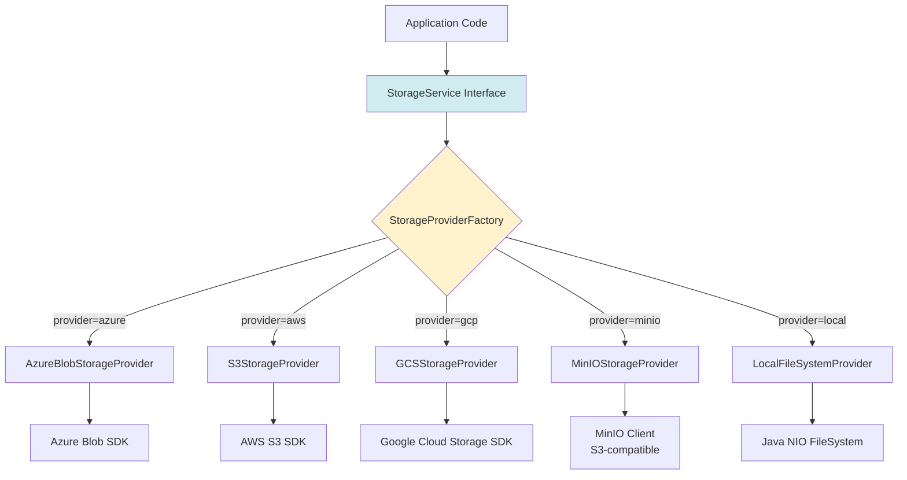
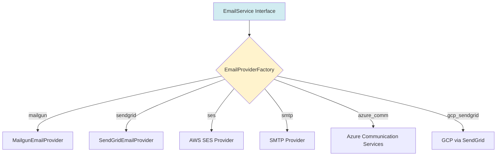
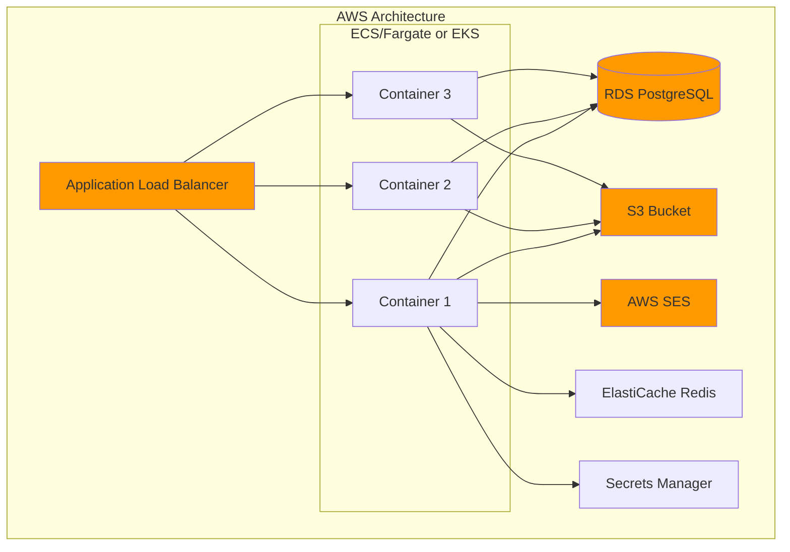
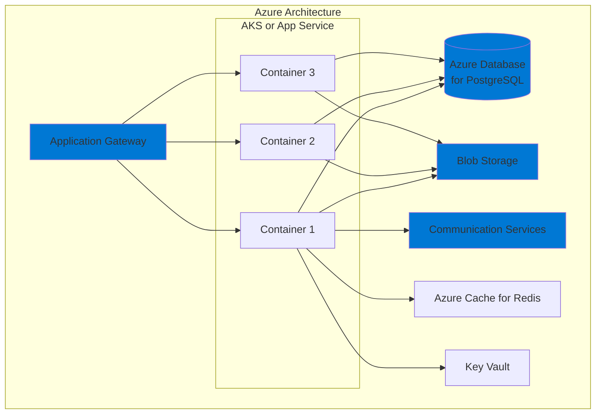
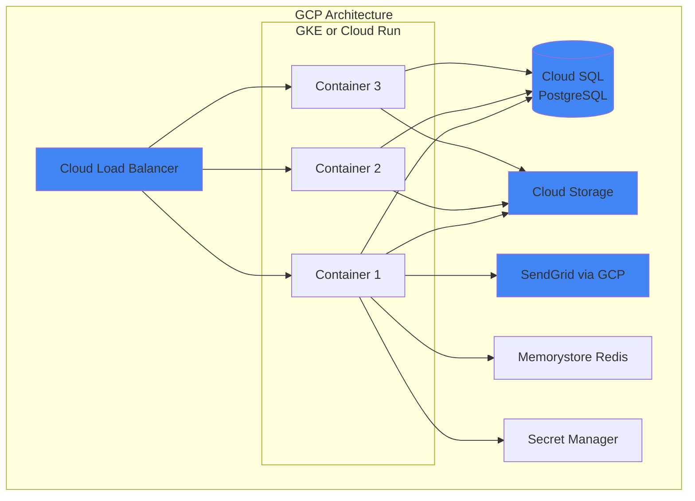
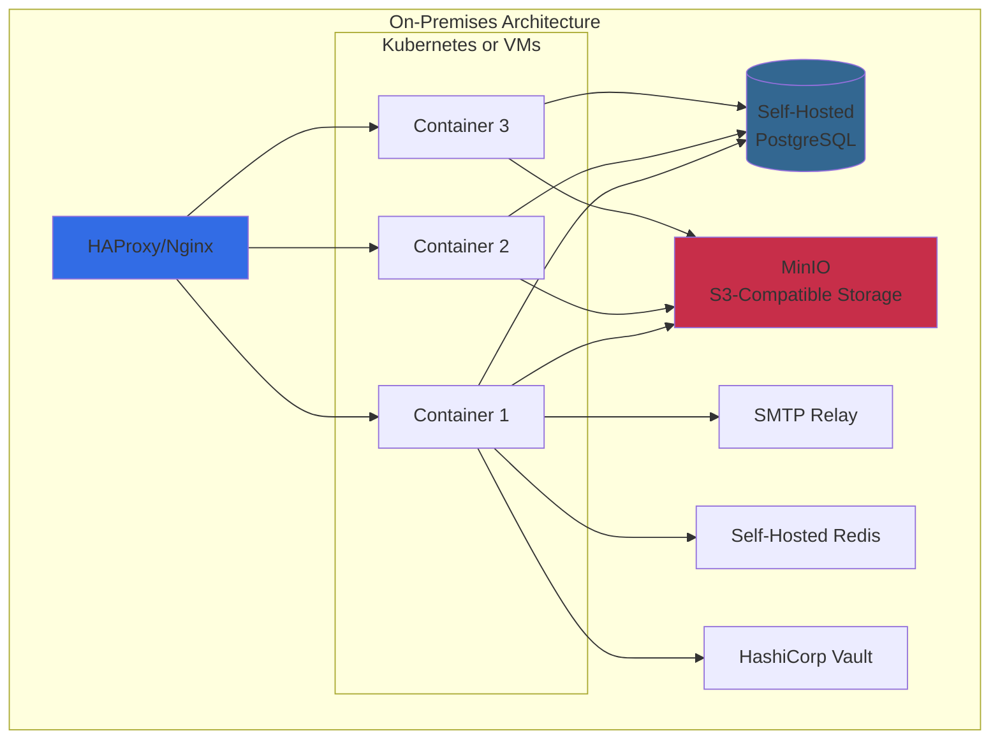

# Cloud Provider Abstraction Strategy

## Overview

The target architecture must be **cloud-agnostic**, allowing states to deploy SHIBA on their preferred cloud provider (AWS, Azure, GCP) or on-premises infrastructure without code changes.

---

## Current Cloud Dependencies (Azure-Specific)

### Azure Blob Storage
**File:** `/src/main/java/org/codeforamerica/shiba/documents/AzureDocumentRepository.java`

**Current Implementation:**
```java
public class AzureDocumentRepository implements CloudDocumentRepository {
    private final BlobContainerClient containerClient; // Azure SDK

    public void upload(String filename, byte[] fileBytes) {
        containerClient.getBlobClient(filename).upload(fileBytes);
    }
}
```

**Configuration:**
```yaml
azure:
  blob:
    connection-string: ${AZURE_STORAGE_CONNECTION_STRING}
    container-name: "uploaded-documents"
```

---

## Cloud-Agnostic Architecture

### Storage Abstraction Layer



### Proposed Interface

```java
/**
 * Cloud-agnostic storage service
 */
public interface StorageService {
    /**
     * Upload file to storage
     */
    void upload(String key, InputStream inputStream, long size, Map<String, String> metadata);

    /**
     * Download file from storage
     */
    InputStream download(String key) throws NotFoundException;

    /**
     * Delete file from storage
     */
    void delete(String key);

    /**
     * Check if file exists
     */
    boolean exists(String key);

    /**
     * List files with prefix
     */
    List<StorageObject> list(String prefix);

    /**
     * Generate presigned/temporary URL for direct access
     * @param key File key
     * @param expiresIn Duration until URL expires
     * @return Temporary URL or empty if not supported
     */
    Optional<String> generatePresignedUrl(String key, Duration expiresIn);

    /**
     * Get storage provider type
     */
    StorageProviderType getProviderType();
}

public class StorageObject {
    private String key;
    private long size;
    private Instant lastModified;
    private Map<String, String> metadata;
}

public enum StorageProviderType {
    AZURE_BLOB,
    AWS_S3,
    GCS,
    MINIO,
    LOCAL_FILESYSTEM
}
```

---

## Implementation Options

### 1. AWS S3 Provider

```java
@Component
@ConditionalOnProperty(name = "storage.provider", havingValue = "aws_s3")
public class S3StorageProvider implements StorageService {

    private final S3Client s3Client;
    private final String bucketName;

    public S3StorageProvider(S3StorageConfig config) {
        this.s3Client = S3Client.builder()
            .region(Region.of(config.getRegion()))
            .credentialsProvider(DefaultCredentialsProvider.create())
            .build();
        this.bucketName = config.getBucketName();
    }

    @Override
    public void upload(String key, InputStream inputStream, long size, Map<String, String> metadata) {
        PutObjectRequest request = PutObjectRequest.builder()
            .bucket(bucketName)
            .key(key)
            .metadata(metadata)
            .build();

        s3Client.putObject(request, RequestBody.fromInputStream(inputStream, size));
    }

    @Override
    public InputStream download(String key) throws NotFoundException {
        try {
            GetObjectRequest request = GetObjectRequest.builder()
                .bucket(bucketName)
                .key(key)
                .build();

            return s3Client.getObject(request);
        } catch (NoSuchKeyException e) {
            throw new NotFoundException("File not found: " + key);
        }
    }

    @Override
    public Optional<String> generatePresignedUrl(String key, Duration expiresIn) {
        S3Presigner presigner = S3Presigner.create();
        GetObjectRequest request = GetObjectRequest.builder()
            .bucket(bucketName)
            .key(key)
            .build();

        GetObjectPresignRequest presignRequest = GetObjectPresignRequest.builder()
            .signatureDuration(expiresIn)
            .getObjectRequest(request)
            .build();

        PresignedGetObjectRequest presignedRequest = presigner.presignGetObject(presignRequest);
        return Optional.of(presignedRequest.url().toString());
    }

    @Override
    public StorageProviderType getProviderType() {
        return StorageProviderType.AWS_S3;
    }
}
```

**Configuration:**
```yaml
storage:
  provider: aws_s3
  aws_s3:
    region: us-east-1
    bucket_name: shiba-documents-production
    # Credentials from environment or IAM role
```

### 2. Azure Blob Provider (Refactored)

```java
@Component
@ConditionalOnProperty(name = "storage.provider", havingValue = "azure_blob")
public class AzureBlobStorageProvider implements StorageService {

    private final BlobContainerClient containerClient;

    public AzureBlobStorageProvider(AzureStorageConfig config) {
        BlobServiceClient serviceClient = new BlobServiceClientBuilder()
            .connectionString(config.getConnectionString())
            .buildClient();
        this.containerClient = serviceClient.getBlobContainerClient(config.getContainerName());
    }

    @Override
    public void upload(String key, InputStream inputStream, long size, Map<String, String> metadata) {
        BlobClient blobClient = containerClient.getBlobClient(key);
        blobClient.upload(inputStream, size, true);
        if (!metadata.isEmpty()) {
            blobClient.setMetadata(metadata);
        }
    }

    @Override
    public InputStream download(String key) throws NotFoundException {
        try {
            BlobClient blobClient = containerClient.getBlobClient(key);
            return blobClient.openInputStream();
        } catch (BlobStorageException e) {
            throw new NotFoundException("File not found: " + key);
        }
    }

    @Override
    public Optional<String> generatePresignedUrl(String key, Duration expiresIn) {
        BlobClient blobClient = containerClient.getBlobClient(key);
        OffsetDateTime expiryTime = OffsetDateTime.now().plus(expiresIn);

        BlobSasPermission permission = new BlobSasPermission().setReadPermission(true);
        BlobServiceSasSignatureValues sasValues = new BlobServiceSasSignatureValues(expiryTime, permission);

        String sasToken = blobClient.generateSas(sasValues);
        return Optional.of(blobClient.getBlobUrl() + "?" + sasToken);
    }

    @Override
    public StorageProviderType getProviderType() {
        return StorageProviderType.AZURE_BLOB;
    }
}
```

**Configuration:**
```yaml
storage:
  provider: azure_blob
  azure_blob:
    connection_string: ${AZURE_STORAGE_CONNECTION_STRING}
    container_name: uploaded-documents
```

### 3. Google Cloud Storage Provider

```java
@Component
@ConditionalOnProperty(name = "storage.provider", havingValue = "gcs")
public class GCSStorageProvider implements StorageService {

    private final Storage storage;
    private final String bucketName;

    public GCSStorageProvider(GCSStorageConfig config) {
        this.storage = StorageOptions.newBuilder()
            .setProjectId(config.getProjectId())
            .build()
            .getService();
        this.bucketName = config.getBucketName();
    }

    @Override
    public void upload(String key, InputStream inputStream, long size, Map<String, String> metadata) {
        BlobId blobId = BlobId.of(bucketName, key);
        BlobInfo.Builder builder = BlobInfo.newBuilder(blobId);
        if (!metadata.isEmpty()) {
            builder.setMetadata(metadata);
        }
        BlobInfo blobInfo = builder.build();

        storage.createFrom(blobInfo, inputStream);
    }

    @Override
    public InputStream download(String key) throws NotFoundException {
        Blob blob = storage.get(BlobId.of(bucketName, key));
        if (blob == null) {
            throw new NotFoundException("File not found: " + key);
        }
        return Channels.newInputStream(blob.reader());
    }

    @Override
    public Optional<String> generatePresignedUrl(String key, Duration expiresIn) {
        BlobInfo blobInfo = BlobInfo.newBuilder(BlobId.of(bucketName, key)).build();
        URL url = storage.signUrl(
            blobInfo,
            expiresIn.toMinutes(),
            TimeUnit.MINUTES,
            Storage.SignUrlOption.withV4Signature()
        );
        return Optional.of(url.toString());
    }

    @Override
    public StorageProviderType getProviderType() {
        return StorageProviderType.GCS;
    }
}
```

**Configuration:**
```yaml
storage:
  provider: gcs
  gcs:
    project_id: my-state-project
    bucket_name: shiba-documents
    # Credentials from GOOGLE_APPLICATION_CREDENTIALS env var
```

### 4. MinIO Provider (S3-Compatible, Self-Hosted)

```java
@Component
@ConditionalOnProperty(name = "storage.provider", havingValue = "minio")
public class MinIOStorageProvider implements StorageService {

    private final MinioClient minioClient;
    private final String bucketName;

    public MinIOStorageProvider(MinIOStorageConfig config) {
        this.minioClient = MinioClient.builder()
            .endpoint(config.getEndpoint())
            .credentials(config.getAccessKey(), config.getSecretKey())
            .build();
        this.bucketName = config.getBucketName();

        // Ensure bucket exists
        ensureBucketExists();
    }

    @Override
    public void upload(String key, InputStream inputStream, long size, Map<String, String> metadata) {
        try {
            minioClient.putObject(
                PutObjectArgs.builder()
                    .bucket(bucketName)
                    .object(key)
                    .stream(inputStream, size, -1)
                    .userMetadata(metadata)
                    .build()
            );
        } catch (Exception e) {
            throw new StorageException("Upload failed", e);
        }
    }

    @Override
    public InputStream download(String key) throws NotFoundException {
        try {
            return minioClient.getObject(
                GetObjectArgs.builder()
                    .bucket(bucketName)
                    .object(key)
                    .build()
            );
        } catch (ErrorResponseException e) {
            if (e.errorResponse().code().equals("NoSuchKey")) {
                throw new NotFoundException("File not found: " + key);
            }
            throw new StorageException("Download failed", e);
        } catch (Exception e) {
            throw new StorageException("Download failed", e);
        }
    }

    @Override
    public Optional<String> generatePresignedUrl(String key, Duration expiresIn) {
        try {
            String url = minioClient.getPresignedObjectUrl(
                GetPresignedObjectUrlArgs.builder()
                    .method(Method.GET)
                    .bucket(bucketName)
                    .object(key)
                    .expiry((int) expiresIn.toSeconds())
                    .build()
            );
            return Optional.of(url);
        } catch (Exception e) {
            return Optional.empty();
        }
    }

    @Override
    public StorageProviderType getProviderType() {
        return StorageProviderType.MINIO;
    }
}
```

**Configuration:**
```yaml
storage:
  provider: minio
  minio:
    endpoint: https://minio.state.internal:9000
    access_key: ${MINIO_ACCESS_KEY}
    secret_key: ${MINIO_SECRET_KEY}
    bucket_name: shiba-documents
```

### 5. Local FileSystem Provider (Development/Small States)

```java
@Component
@ConditionalOnProperty(name = "storage.provider", havingValue = "local_filesystem")
public class LocalFileSystemStorageProvider implements StorageService {

    private final Path basePath;

    public LocalFileSystemStorageProvider(LocalStorageConfig config) {
        this.basePath = Paths.get(config.getBasePath());
        try {
            Files.createDirectories(basePath);
        } catch (IOException e) {
            throw new StorageException("Failed to create storage directory", e);
        }
    }

    @Override
    public void upload(String key, InputStream inputStream, long size, Map<String, String> metadata) {
        Path filePath = basePath.resolve(key);
        try {
            Files.createDirectories(filePath.getParent());
            Files.copy(inputStream, filePath, StandardCopyOption.REPLACE_EXISTING);

            // Store metadata as extended attributes or separate file
            if (!metadata.isEmpty()) {
                storeMetadata(filePath, metadata);
            }
        } catch (IOException e) {
            throw new StorageException("Upload failed", e);
        }
    }

    @Override
    public InputStream download(String key) throws NotFoundException {
        Path filePath = basePath.resolve(key);
        if (!Files.exists(filePath)) {
            throw new NotFoundException("File not found: " + key);
        }
        try {
            return Files.newInputStream(filePath);
        } catch (IOException e) {
            throw new StorageException("Download failed", e);
        }
    }

    @Override
    public Optional<String> generatePresignedUrl(String key, Duration expiresIn) {
        // Not supported for local filesystem
        return Optional.empty();
    }

    @Override
    public StorageProviderType getProviderType() {
        return StorageProviderType.LOCAL_FILESYSTEM;
    }
}
```

**Configuration:**
```yaml
storage:
  provider: local_filesystem
  local_filesystem:
    base_path: /var/shiba/documents
```

---

## Database Abstraction

### Current: PostgreSQL-Specific

SHIBA currently uses PostgreSQL with specific features:
- JSONB data type
- Full-text search
- Triggers and functions

### Cloud-Agnostic Database Strategy

#### Option 1: Stay with PostgreSQL (Recommended)

PostgreSQL is available on all major cloud providers:
- **AWS:** RDS for PostgreSQL, Aurora PostgreSQL
- **Azure:** Azure Database for PostgreSQL
- **GCP:** Cloud SQL for PostgreSQL
- **On-Premises:** Self-hosted PostgreSQL

**Configuration by Provider:**

```yaml
# AWS RDS
database:
  provider: aws_rds_postgresql
  url: jdbc:postgresql://shiba-db.abc123.us-east-1.rds.amazonaws.com:5432/shiba
  username: ${DB_USERNAME}
  password: ${DB_PASSWORD}

# Azure Database
database:
  provider: azure_postgresql
  url: jdbc:postgresql://shiba-db.postgres.database.azure.com:5432/shiba
  username: ${DB_USERNAME}@shiba-db
  password: ${DB_PASSWORD}
  ssl: true
  ssl_mode: require

# GCP Cloud SQL
database:
  provider: gcp_cloud_sql_postgresql
  url: jdbc:postgresql:///${DB_NAME}
  cloud_sql_instance: project:region:instance
  username: ${DB_USERNAME}
  password: ${DB_PASSWORD}

# On-Premises
database:
  provider: postgresql
  url: jdbc:postgresql://db.state.internal:5432/shiba
  username: ${DB_USERNAME}
  password: ${DB_PASSWORD}
```

#### Option 2: JPA Abstraction (If Switching Databases)

If states need to use different databases (MySQL, SQL Server, Oracle):

```java
@Entity
@Table(name = "applications")
public class Application {
    @Id
    private String id;

    @Column(name = "completed_at")
    private Instant completedAt;

    // Use @Type for JSONB with Hibernate 6+
    @JdbcTypeCode(SqlTypes.JSON)
    @Column(name = "application_data", columnDefinition = "jsonb")
    private ApplicationData applicationData;

    // Or use String with manual serialization
    // @Column(name = "application_data", columnDefinition = "text")
    // private String applicationDataJson;
}
```

**Support Matrix:**
- PostgreSQL: Native JSONB
- MySQL 8.0+: JSON column type
- SQL Server 2016+: NVARCHAR(MAX) with JSON functions
- Oracle 12c+: VARCHAR2/CLOB with JSON functions

---

## Email Service Abstraction (Already Cloud-Agnostic)

### Current: Mailgun

### Proposed: Multi-Provider Support



**Configuration:**

```yaml
# Mailgun (current)
email:
  provider: mailgun
  mailgun:
    domain: mail.mnbenefits.mn.gov
    api_key: ${MAILGUN_API_KEY}
    from: help@mnbenefits.org

# AWS SES
email:
  provider: aws_ses
  aws_ses:
    region: us-east-1
    from: help@benefits.state.gov
    # Credentials from IAM role or environment

# Azure Communication Services
email:
  provider: azure_communication_services
  azure_communication_services:
    connection_string: ${AZURE_COMM_CONNECTION_STRING}
    from: help@benefits.state.gov

# Generic SMTP (any provider)
email:
  provider: smtp
  smtp:
    host: smtp.state.gov
    port: 587
    username: ${SMTP_USERNAME}
    password: ${SMTP_PASSWORD}
    tls: true
    from: help@benefits.state.gov
```

---

## Complete Cloud-Agnostic Configuration

### Configuration Structure

```yaml
# Tenant-level configuration
tenant:
  id: minnesota
  state_code: MN
  name: Minnesota

# Infrastructure configuration (per deployment)
infrastructure:
  cloud_provider: aws  # aws, azure, gcp, on_premises

  # Storage (documents)
  storage:
    provider: aws_s3  # aws_s3, azure_blob, gcs, minio, local_filesystem
    config:
      region: us-east-1
      bucket_name: mn-shiba-documents

  # Database
  database:
    provider: aws_rds_postgresql
    url: jdbc:postgresql://shiba.abc.us-east-1.rds.amazonaws.com/shiba
    username: ${DB_USERNAME}
    password: ${DB_PASSWORD}

  # Email
  email:
    provider: aws_ses
    config:
      region: us-east-1
      from: help@mnbenefits.org

  # Session storage
  session:
    provider: redis  # redis, jdbc, none (in-memory)
    redis:
      host: redis.cluster.local
      port: 6379
      password: ${REDIS_PASSWORD}

  # Cache (optional)
  cache:
    provider: redis  # redis, memcached, caffeine (local)
    redis:
      host: redis.cluster.local
      port: 6379

  # Secrets management
  secrets:
    provider: aws_secrets_manager  # aws_secrets_manager, azure_key_vault, gcp_secret_manager, env_vars
    config:
      region: us-east-1
```

---

## Deployment Patterns by Cloud Provider

### AWS Deployment



### Azure Deployment



### GCP Deployment



### On-Premises Deployment



---

## Migration Guide: Azure to Cloud-Agnostic

### Step 1: Add Storage Abstraction

```java
// Before (Azure-specific)
@Autowired
private AzureDocumentRepository documentRepository;

// After (Cloud-agnostic)
@Autowired
private StorageService storageService;
```

### Step 2: Update Configuration

```yaml
# Before
azure:
  blob:
    connection-string: ${AZURE_STORAGE_CONNECTION_STRING}
    container-name: "uploaded-documents"

# After
storage:
  provider: ${STORAGE_PROVIDER:azure_blob}  # Default to Azure, override with env var
  azure_blob:
    connection_string: ${AZURE_STORAGE_CONNECTION_STRING}
    container_name: uploaded-documents
  aws_s3:
    region: ${AWS_REGION:us-east-1}
    bucket_name: ${S3_BUCKET_NAME}
```

### Step 3: Add Provider Implementations

See implementation sections above for each provider.

### Step 4: Testing

```java
@TestConfiguration
public class TestStorageConfig {
    @Bean
    @Primary
    public StorageService testStorageService() {
        return new InMemoryStorageService(); // For tests
    }
}
```

---

## Recommendation

**Preferred Stack (Cloud-Agnostic):**
- **Storage:** S3-compatible (works with AWS S3, MinIO, GCS with interoperability)
- **Database:** PostgreSQL (available everywhere)
- **Email:** SMTP (universal fallback) + cloud-specific optimizations
- **Cache/Session:** Redis (available everywhere)
- **Container Orchestration:** Kubernetes (works on all clouds + on-prem)

**Configuration Strategy:**
- Environment variables for cloud-specific settings
- Provider selection via `STORAGE_PROVIDER`, `EMAIL_PROVIDER`, etc.
- Sensible defaults for each cloud (AWS → S3, Azure → Blob, etc.)
- Documentation for each supported configuration

This approach allows states to:
1. Choose their preferred cloud provider
2. Switch providers if needed (vendor lock-in avoidance)
3. Start on-premises and migrate to cloud later
4. Use hybrid deployments (e.g., on-prem DB, cloud storage)
