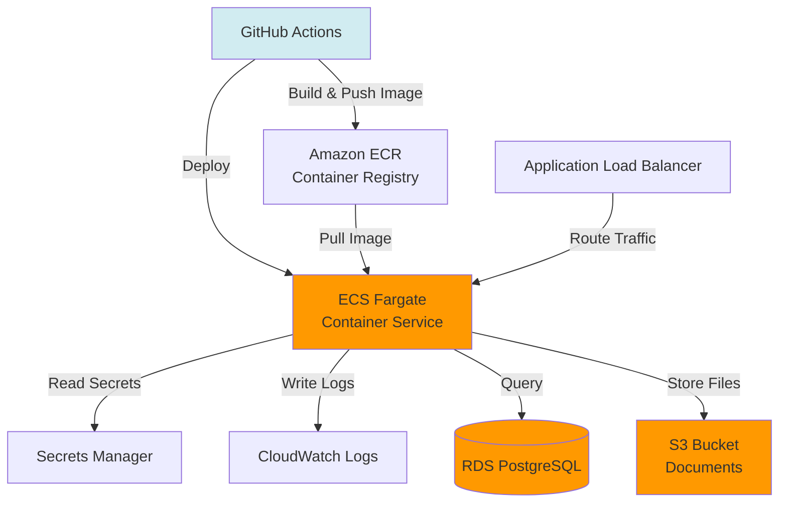

# AWS Deployment Guide with GitHub Actions

## Current State Analysis

### Current Deployment (Aptible)
- **Platform:** Aptible (PaaS)
- **Build:** Dockerfile with Gradle
- **Deployment:** Git push to Aptible remote
- **CI/CD:** GitHub Actions → Aptible CLI
- **Environments:** demo, production

### Current Workflow
```yaml
# .github/workflows/deploy-to-demo.yml
1. Tests pass on main branch
2. Deploy workflow triggers
3. Push to Aptible git remote
4. Aptible builds and deploys
```

---

## Target AWS Architecture

### Option 1: AWS ECS Fargate (Recommended)

**Best for:** Production-ready, serverless containers, easy scaling



### Infrastructure Components

| Component | AWS Service | Purpose |
|-----------|-------------|---------|
| **Compute** | ECS Fargate | Run Spring Boot containers |
| **Load Balancer** | ALB | SSL termination, routing |
| **Database** | RDS PostgreSQL 15 | Application data |
| **Storage** | S3 | Document uploads |
| **Cache** | ElastiCache Redis | Session + config cache |
| **Secrets** | Secrets Manager | Credentials, API keys |
| **Monitoring** | CloudWatch | Logs, metrics, alarms |
| **Networking** | VPC | Isolated network |
| **CI/CD** | GitHub Actions + ECR | Build and deploy |

---

## AWS Infrastructure Setup

### 1. Terraform Configuration

```hcl
# infrastructure/terraform/main.tf

terraform {
  required_version = ">= 1.0"

  backend "s3" {
    bucket = "shiba-terraform-state"
    key    = "shiba/terraform.tfstate"
    region = "us-east-1"
    encrypt = true
  }

  required_providers {
    aws = {
      source  = "hashicorp/aws"
      version = "~> 5.0"
    }
  }
}

provider "aws" {
  region = var.aws_region

  default_tags {
    tags = {
      Project     = "SHIBA"
      Environment = var.environment
      ManagedBy   = "Terraform"
    }
  }
}

# Variables
variable "environment" {
  description = "Environment name (dev, staging, production)"
  type        = string
}

variable "aws_region" {
  description = "AWS region"
  type        = string
  default     = "us-east-1"
}

variable "app_name" {
  description = "Application name"
  type        = string
  default     = "shiba"
}

variable "state_code" {
  description = "State code (e.g., MN, CA)"
  type        = string
}
```

### 2. VPC Configuration

```hcl
# infrastructure/terraform/vpc.tf

module "vpc" {
  source  = "terraform-aws-modules/vpc/aws"
  version = "~> 5.0"

  name = "${var.app_name}-${var.environment}-vpc"
  cidr = "10.0.0.0/16"

  azs              = ["${var.aws_region}a", "${var.aws_region}b", "${var.aws_region}c"]
  private_subnets  = ["10.0.1.0/24", "10.0.2.0/24", "10.0.3.0/24"]
  public_subnets   = ["10.0.101.0/24", "10.0.102.0/24", "10.0.103.0/24"]
  database_subnets = ["10.0.201.0/24", "10.0.202.0/24", "10.0.203.0/24"]

  enable_nat_gateway   = true
  single_nat_gateway   = var.environment != "production"
  enable_dns_hostnames = true
  enable_dns_support   = true

  tags = {
    Name = "${var.app_name}-${var.environment}"
  }
}
```

### 3. RDS PostgreSQL

```hcl
# infrastructure/terraform/rds.tf

resource "aws_db_subnet_group" "main" {
  name       = "${var.app_name}-${var.environment}-db-subnet"
  subnet_ids = module.vpc.database_subnets

  tags = {
    Name = "${var.app_name}-${var.environment}-db-subnet"
  }
}

resource "aws_security_group" "rds" {
  name        = "${var.app_name}-${var.environment}-rds-sg"
  description = "Security group for RDS PostgreSQL"
  vpc_id      = module.vpc.vpc_id

  ingress {
    from_port       = 5432
    to_port         = 5432
    protocol        = "tcp"
    security_groups = [aws_security_group.ecs_tasks.id]
    description     = "PostgreSQL from ECS tasks"
  }

  egress {
    from_port   = 0
    to_port     = 0
    protocol    = "-1"
    cidr_blocks = ["0.0.0.0/0"]
  }
}

resource "aws_db_instance" "main" {
  identifier     = "${var.app_name}-${var.environment}"
  engine         = "postgres"
  engine_version = "15.4"
  instance_class = var.environment == "production" ? "db.t3.medium" : "db.t3.small"

  allocated_storage     = var.environment == "production" ? 100 : 20
  max_allocated_storage = var.environment == "production" ? 500 : 100
  storage_encrypted     = true

  db_name  = "shiba"
  username = "shiba_admin"
  password = random_password.db_password.result

  db_subnet_group_name   = aws_db_subnet_group.main.name
  vpc_security_group_ids = [aws_security_group.rds.id]

  backup_retention_period = var.environment == "production" ? 30 : 7
  backup_window           = "03:00-04:00"
  maintenance_window      = "sun:04:00-sun:05:00"

  enabled_cloudwatch_logs_exports = ["postgresql", "upgrade"]

  deletion_protection = var.environment == "production"
  skip_final_snapshot = var.environment != "production"
  final_snapshot_identifier = var.environment == "production" ? "${var.app_name}-${var.environment}-final-${formatdate("YYYY-MM-DD-hhmm", timestamp())}" : null

  tags = {
    Name = "${var.app_name}-${var.environment}-db"
  }
}

resource "random_password" "db_password" {
  length  = 32
  special = true
}

resource "aws_secretsmanager_secret" "db_password" {
  name = "${var.app_name}/${var.environment}/db-password"
}

resource "aws_secretsmanager_secret_version" "db_password" {
  secret_id = aws_secretsmanager_secret.db_password.id
  secret_string = jsonencode({
    username = aws_db_instance.main.username
    password = random_password.db_password.result
    host     = aws_db_instance.main.address
    port     = aws_db_instance.main.port
    dbname   = aws_db_instance.main.db_name
  })
}
```

### 4. S3 Bucket for Documents

```hcl
# infrastructure/terraform/s3.tf

resource "aws_s3_bucket" "documents" {
  bucket = "${var.app_name}-${var.environment}-documents-${var.state_code}"

  tags = {
    Name        = "${var.app_name}-${var.environment}-documents"
    Environment = var.environment
  }
}

resource "aws_s3_bucket_versioning" "documents" {
  bucket = aws_s3_bucket.documents.id

  versioning_configuration {
    status = "Enabled"
  }
}

resource "aws_s3_bucket_encryption" "documents" {
  bucket = aws_s3_bucket.documents.id

  rule {
    apply_server_side_encryption_by_default {
      sse_algorithm = "AES256"
    }
  }
}

resource "aws_s3_bucket_public_access_block" "documents" {
  bucket = aws_s3_bucket.documents.id

  block_public_acls       = true
  block_public_policy     = true
  ignore_public_acls      = true
  restrict_public_buckets = true
}

resource "aws_s3_bucket_lifecycle_configuration" "documents" {
  bucket = aws_s3_bucket.documents.id

  rule {
    id     = "transition-to-ia"
    status = "Enabled"

    transition {
      days          = 30
      storage_class = "STANDARD_IA"
    }

    transition {
      days          = 90
      storage_class = "GLACIER_IR"
    }
  }

  rule {
    id     = "expire-old-versions"
    status = "Enabled"

    noncurrent_version_expiration {
      noncurrent_days = 90
    }
  }
}
```

### 5. ElastiCache Redis

```hcl
# infrastructure/terraform/elasticache.tf

resource "aws_elasticache_subnet_group" "main" {
  name       = "${var.app_name}-${var.environment}-cache-subnet"
  subnet_ids = module.vpc.private_subnets
}

resource "aws_security_group" "redis" {
  name        = "${var.app_name}-${var.environment}-redis-sg"
  description = "Security group for ElastiCache Redis"
  vpc_id      = module.vpc.vpc_id

  ingress {
    from_port       = 6379
    to_port         = 6379
    protocol        = "tcp"
    security_groups = [aws_security_group.ecs_tasks.id]
    description     = "Redis from ECS tasks"
  }

  egress {
    from_port   = 0
    to_port     = 0
    protocol    = "-1"
    cidr_blocks = ["0.0.0.0/0"]
  }
}

resource "aws_elasticache_replication_group" "main" {
  replication_group_id       = "${var.app_name}-${var.environment}"
  replication_group_description = "Redis cache for SHIBA"

  engine               = "redis"
  engine_version       = "7.0"
  node_type            = var.environment == "production" ? "cache.t3.medium" : "cache.t3.micro"
  number_cache_clusters = var.environment == "production" ? 2 : 1

  port                  = 6379
  parameter_group_name  = "default.redis7"
  subnet_group_name     = aws_elasticache_subnet_group.main.name
  security_group_ids    = [aws_security_group.redis.id]

  automatic_failover_enabled = var.environment == "production"
  multi_az_enabled           = var.environment == "production"
  at_rest_encryption_enabled = true
  transit_encryption_enabled = true

  maintenance_window = "sun:05:00-sun:06:00"
  snapshot_window    = "03:00-04:00"
  snapshot_retention_limit = var.environment == "production" ? 5 : 1

  tags = {
    Name = "${var.app_name}-${var.environment}-redis"
  }
}
```

### 6. ECS Cluster and Service

```hcl
# infrastructure/terraform/ecs.tf

resource "aws_ecs_cluster" "main" {
  name = "${var.app_name}-${var.environment}"

  setting {
    name  = "containerInsights"
    value = "enabled"
  }

  tags = {
    Name = "${var.app_name}-${var.environment}"
  }
}

resource "aws_ecs_cluster_capacity_providers" "main" {
  cluster_name = aws_ecs_cluster.main.name

  capacity_providers = ["FARGATE", "FARGATE_SPOT"]

  default_capacity_provider_strategy {
    capacity_provider = var.environment == "production" ? "FARGATE" : "FARGATE_SPOT"
    weight            = 1
  }
}

resource "aws_security_group" "ecs_tasks" {
  name        = "${var.app_name}-${var.environment}-ecs-tasks-sg"
  description = "Security group for ECS tasks"
  vpc_id      = module.vpc.vpc_id

  ingress {
    from_port       = 8080
    to_port         = 8080
    protocol        = "tcp"
    security_groups = [aws_security_group.alb.id]
    description     = "HTTP from ALB"
  }

  egress {
    from_port   = 0
    to_port     = 0
    protocol    = "-1"
    cidr_blocks = ["0.0.0.0/0"]
    description = "Allow all outbound"
  }

  tags = {
    Name = "${var.app_name}-${var.environment}-ecs-tasks"
  }
}

resource "aws_cloudwatch_log_group" "app" {
  name              = "/ecs/${var.app_name}-${var.environment}"
  retention_in_days = var.environment == "production" ? 30 : 7

  tags = {
    Name = "${var.app_name}-${var.environment}"
  }
}

resource "aws_ecs_task_definition" "app" {
  family                   = "${var.app_name}-${var.environment}"
  requires_compatibilities = ["FARGATE"]
  network_mode             = "awsvpc"
  cpu                      = var.environment == "production" ? "1024" : "512"
  memory                   = var.environment == "production" ? "2048" : "1024"
  execution_role_arn       = aws_iam_role.ecs_execution.arn
  task_role_arn            = aws_iam_role.ecs_task.arn

  container_definitions = jsonencode([
    {
      name  = "app"
      image = "${aws_ecr_repository.app.repository_url}:latest"

      portMappings = [
        {
          containerPort = 8080
          protocol      = "tcp"
        }
      ]

      environment = [
        {
          name  = "SPRING_PROFILES_ACTIVE"
          value = var.environment
        },
        {
          name  = "AWS_REGION"
          value = var.aws_region
        }
      ]

      secrets = [
        {
          name      = "SPRING_DATASOURCE_URL"
          valueFrom = "${aws_secretsmanager_secret.db_password.arn}:host::"
        },
        {
          name      = "SPRING_DATASOURCE_USERNAME"
          valueFrom = "${aws_secretsmanager_secret.db_password.arn}:username::"
        },
        {
          name      = "SPRING_DATASOURCE_PASSWORD"
          valueFrom = "${aws_secretsmanager_secret.db_password.arn}:password::"
        },
        {
          name      = "SPRING_REDIS_HOST"
          valueFrom = "${aws_secretsmanager_secret.redis_config.arn}:host::"
        }
      ]

      logConfiguration = {
        logDriver = "awslogs"
        options = {
          "awslogs-group"         = aws_cloudwatch_log_group.app.name
          "awslogs-region"        = var.aws_region
          "awslogs-stream-prefix" = "ecs"
        }
      }

      healthCheck = {
        command     = ["CMD-SHELL", "curl -f http://localhost:8080/actuator/health || exit 1"]
        interval    = 30
        timeout     = 5
        retries     = 3
        startPeriod = 60
      }
    }
  ])

  tags = {
    Name = "${var.app_name}-${var.environment}"
  }
}

resource "aws_ecs_service" "app" {
  name            = "${var.app_name}-${var.environment}"
  cluster         = aws_ecs_cluster.main.id
  task_definition = aws_ecs_task_definition.app.arn
  desired_count   = var.environment == "production" ? 2 : 1
  launch_type     = "FARGATE"

  network_configuration {
    subnets          = module.vpc.private_subnets
    security_groups  = [aws_security_group.ecs_tasks.id]
    assign_public_ip = false
  }

  load_balancer {
    target_group_arn = aws_lb_target_group.app.arn
    container_name   = "app"
    container_port   = 8080
  }

  deployment_configuration {
    maximum_percent         = 200
    minimum_healthy_percent = 100
  }

  depends_on = [aws_lb_listener.https]

  tags = {
    Name = "${var.app_name}-${var.environment}"
  }
}
```

### 7. Application Load Balancer

```hcl
# infrastructure/terraform/alb.tf

resource "aws_security_group" "alb" {
  name        = "${var.app_name}-${var.environment}-alb-sg"
  description = "Security group for Application Load Balancer"
  vpc_id      = module.vpc.vpc_id

  ingress {
    from_port   = 443
    to_port     = 443
    protocol    = "tcp"
    cidr_blocks = ["0.0.0.0/0"]
    description = "HTTPS from internet"
  }

  ingress {
    from_port   = 80
    to_port     = 80
    protocol    = "tcp"
    cidr_blocks = ["0.0.0.0/0"]
    description = "HTTP from internet (redirect to HTTPS)"
  }

  egress {
    from_port   = 0
    to_port     = 0
    protocol    = "-1"
    cidr_blocks = ["0.0.0.0/0"]
  }

  tags = {
    Name = "${var.app_name}-${var.environment}-alb"
  }
}

resource "aws_lb" "main" {
  name               = "${var.app_name}-${var.environment}-alb"
  internal           = false
  load_balancer_type = "application"
  security_groups    = [aws_security_group.alb.id]
  subnets            = module.vpc.public_subnets

  enable_deletion_protection = var.environment == "production"
  enable_http2               = true
  enable_cross_zone_load_balancing = true

  tags = {
    Name = "${var.app_name}-${var.environment}-alb"
  }
}

resource "aws_lb_target_group" "app" {
  name        = "${var.app_name}-${var.environment}-tg"
  port        = 8080
  protocol    = "HTTP"
  vpc_id      = module.vpc.vpc_id
  target_type = "ip"

  health_check {
    enabled             = true
    healthy_threshold   = 2
    unhealthy_threshold = 3
    timeout             = 5
    interval            = 30
    path                = "/actuator/health"
    matcher             = "200"
  }

  deregistration_delay = 30

  tags = {
    Name = "${var.app_name}-${var.environment}-tg"
  }
}

resource "aws_lb_listener" "http" {
  load_balancer_arn = aws_lb.main.arn
  port              = 80
  protocol          = "HTTP"

  default_action {
    type = "redirect"

    redirect {
      port        = "443"
      protocol    = "HTTPS"
      status_code = "HTTP_301"
    }
  }
}

resource "aws_lb_listener" "https" {
  load_balancer_arn = aws_lb.main.arn
  port              = 443
  protocol          = "HTTPS"
  ssl_policy        = "ELBSecurityPolicy-TLS-1-2-2017-01"
  certificate_arn   = aws_acm_certificate.main.arn

  default_action {
    type             = "forward"
    target_group_arn = aws_lb_target_group.app.arn
  }
}
```

### 8. IAM Roles

```hcl
# infrastructure/terraform/iam.tf

# ECS Task Execution Role (for pulling images, secrets)
resource "aws_iam_role" "ecs_execution" {
  name = "${var.app_name}-${var.environment}-ecs-execution"

  assume_role_policy = jsonencode({
    Version = "2012-10-17"
    Statement = [
      {
        Action = "sts:AssumeRole"
        Effect = "Allow"
        Principal = {
          Service = "ecs-tasks.amazonaws.com"
        }
      }
    ]
  })
}

resource "aws_iam_role_policy_attachment" "ecs_execution" {
  role       = aws_iam_role.ecs_execution.name
  policy_arn = "arn:aws:iam::aws:policy/service-role/AmazonECSTaskExecutionRolePolicy"
}

resource "aws_iam_role_policy" "ecs_execution_secrets" {
  name = "secrets-access"
  role = aws_iam_role.ecs_execution.id

  policy = jsonencode({
    Version = "2012-10-17"
    Statement = [
      {
        Effect = "Allow"
        Action = [
          "secretsmanager:GetSecretValue"
        ]
        Resource = [
          aws_secretsmanager_secret.db_password.arn,
          aws_secretsmanager_secret.redis_config.arn,
          aws_secretsmanager_secret.app_secrets.arn
        ]
      }
    ]
  })
}

# ECS Task Role (for application permissions)
resource "aws_iam_role" "ecs_task" {
  name = "${var.app_name}-${var.environment}-ecs-task"

  assume_role_policy = jsonencode({
    Version = "2012-10-17"
    Statement = [
      {
        Action = "sts:AssumeRole"
        Effect = "Allow"
        Principal = {
          Service = "ecs-tasks.amazonaws.com"
        }
      }
    ]
  })
}

resource "aws_iam_role_policy" "ecs_task_s3" {
  name = "s3-access"
  role = aws_iam_role.ecs_task.id

  policy = jsonencode({
    Version = "2012-10-17"
    Statement = [
      {
        Effect = "Allow"
        Action = [
          "s3:PutObject",
          "s3:GetObject",
          "s3:DeleteObject",
          "s3:ListBucket"
        ]
        Resource = [
          aws_s3_bucket.documents.arn,
          "${aws_s3_bucket.documents.arn}/*"
        ]
      }
    ]
  })
}
```

---

## GitHub Actions Workflows

### 1. Build and Test

```yaml
# .github/workflows/build-and-test.yml

name: Build and Test

on:
  push:
    branches: [main, develop]
  pull_request:
    branches: [main]

env:
  JAVA_VERSION: '17'
  JAVA_DISTRIBUTION: 'temurin'

jobs:
  test:
    name: Run Tests
    runs-on: ubuntu-latest

    steps:
      - name: Checkout code
        uses: actions/checkout@v4

      - name: Set up JDK
        uses: actions/setup-java@v4
        with:
          distribution: ${{ env.JAVA_DISTRIBUTION }}
          java-version: ${{ env.JAVA_VERSION }}
          cache: 'gradle'

      - name: Set up ChromeDriver
        uses: nanasess/setup-chromedriver@v2

      - name: Grant execute permission for gradlew
        run: chmod +x gradlew

      - name: Run unit tests
        run: ./gradlew unitTest

      - name: Run integration tests
        run: ./gradlew dbTest

      - name: Run journey tests
        run: ./gradlew fullFlowJourneyTest

      - name: Upload test results
        if: always()
        uses: actions/upload-artifact@v4
        with:
          name: test-results
          path: build/reports/tests/

      - name: Publish test coverage
        uses: codecov/codecov-action@v3
        if: always()
        with:
          files: build/reports/jacoco/test/jacocoTestReport.xml
```

### 2. Build and Push Docker Image

```yaml
# .github/workflows/build-docker.yml

name: Build Docker Image

on:
  push:
    branches: [main]
  workflow_dispatch:

env:
  AWS_REGION: us-east-1
  ECR_REPOSITORY: shiba

jobs:
  build-and-push:
    name: Build and Push to ECR
    runs-on: ubuntu-latest
    permissions:
      id-token: write
      contents: read

    steps:
      - name: Checkout code
        uses: actions/checkout@v4

      - name: Configure AWS credentials
        uses: aws-actions/configure-aws-credentials@v4
        with:
          role-to-assume: ${{ secrets.AWS_ROLE_ARN }}
          aws-region: ${{ env.AWS_REGION }}

      - name: Login to Amazon ECR
        id: login-ecr
        uses: aws-actions/amazon-ecr-login@v2

      - name: Build, tag, and push image to Amazon ECR
        env:
          ECR_REGISTRY: ${{ steps.login-ecr.outputs.registry }}
          IMAGE_TAG: ${{ github.sha }}
        run: |
          docker build -t $ECR_REGISTRY/$ECR_REPOSITORY:$IMAGE_TAG .
          docker tag $ECR_REGISTRY/$ECR_REPOSITORY:$IMAGE_TAG $ECR_REGISTRY/$ECR_REPOSITORY:latest
          docker push $ECR_REGISTRY/$ECR_REPOSITORY:$IMAGE_TAG
          docker push $ECR_REGISTRY/$ECR_REPOSITORY:latest

      - name: Output image URI
        run: |
          echo "Image URI: ${{ steps.login-ecr.outputs.registry }}/${{ env.ECR_REPOSITORY }}:${{ github.sha }}"
```

### 3. Deploy to AWS

```yaml
# .github/workflows/deploy-aws.yml

name: Deploy to AWS

on:
  workflow_run:
    workflows: ["Build Docker Image"]
    branches: [main]
    types: [completed]
  workflow_dispatch:
    inputs:
      environment:
        description: 'Environment to deploy to'
        required: true
        default: 'staging'
        type: choice
        options:
          - staging
          - production

env:
  AWS_REGION: us-east-1

jobs:
  deploy:
    name: Deploy to ${{ inputs.environment || 'staging' }}
    runs-on: ubuntu-latest
    environment: ${{ inputs.environment || 'staging' }}
    permissions:
      id-token: write
      contents: read

    steps:
      - name: Checkout code
        uses: actions/checkout@v4

      - name: Configure AWS credentials
        uses: aws-actions/configure-aws-credentials@v4
        with:
          role-to-assume: ${{ secrets.AWS_ROLE_ARN }}
          aws-region: ${{ env.AWS_REGION }}

      - name: Login to Amazon ECR
        id: login-ecr
        uses: aws-actions/amazon-ecr-login@v2

      - name: Download task definition
        run: |
          aws ecs describe-task-definition \
            --task-definition shiba-${{ inputs.environment || 'staging' }} \
            --query taskDefinition > task-definition.json

      - name: Fill in the new image ID in the Amazon ECS task definition
        id: task-def
        uses: aws-actions/amazon-ecs-render-task-definition@v1
        with:
          task-definition: task-definition.json
          container-name: app
          image: ${{ steps.login-ecr.outputs.registry }}/shiba:${{ github.sha }}

      - name: Deploy Amazon ECS task definition
        uses: aws-actions/amazon-ecs-deploy-task-definition@v1
        with:
          task-definition: ${{ steps.task-def.outputs.task-definition }}
          service: shiba-${{ inputs.environment || 'staging' }}
          cluster: shiba-${{ inputs.environment || 'staging' }}
          wait-for-service-stability: true

      - name: Run database migrations
        run: |
          TASK_ARN=$(aws ecs run-task \
            --cluster shiba-${{ inputs.environment || 'staging' }} \
            --task-definition shiba-${{ inputs.environment || 'staging' }}-migration \
            --launch-type FARGATE \
            --network-configuration "awsvpcConfiguration={subnets=[${{ secrets.PRIVATE_SUBNETS }}],securityGroups=[${{ secrets.SECURITY_GROUP }}]}" \
            --query 'tasks[0].taskArn' \
            --output text)

          aws ecs wait tasks-stopped --cluster shiba-${{ inputs.environment || 'staging' }} --tasks $TASK_ARN

      - name: Verify deployment
        run: |
          echo "Deployment complete! Verifying health..."
          sleep 30
          HEALTH_URL="https://${{ inputs.environment || 'staging' }}.mnbenefits.org/actuator/health"
          curl -f $HEALTH_URL || exit 1
          echo "Health check passed!"

      - name: Notify deployment success
        if: success()
        uses: 8398a7/action-slack@v3
        with:
          status: success
          text: 'Deployment to ${{ inputs.environment || ''staging'' }} succeeded!'
          webhook_url: ${{ secrets.SLACK_WEBHOOK }}

      - name: Notify deployment failure
        if: failure()
        uses: 8398a7/action-slack@v3
        with:
          status: failure
          text: 'Deployment to ${{ inputs.environment || ''staging'' }} failed!'
          webhook_url: ${{ secrets.SLACK_WEBHOOK }}
```

### 4. Database Migration Task

```yaml
# .github/workflows/run-migration.yml

name: Run Database Migration

on:
  workflow_dispatch:
    inputs:
      environment:
        description: 'Environment'
        required: true
        type: choice
        options:
          - staging
          - production

jobs:
  migrate:
    name: Run Flyway Migration
    runs-on: ubuntu-latest
    environment: ${{ inputs.environment }}
    permissions:
      id-token: write
      contents: read

    steps:
      - name: Checkout code
        uses: actions/checkout@v4

      - name: Configure AWS credentials
        uses: aws-actions/configure-aws-credentials@v4
        with:
          role-to-assume: ${{ secrets.AWS_ROLE_ARN }}
          aws-region: us-east-1

      - name: Get database credentials from Secrets Manager
        id: db-creds
        run: |
          SECRET=$(aws secretsmanager get-secret-value \
            --secret-id shiba/${{ inputs.environment }}/db-password \
            --query SecretString \
            --output text)

          echo "DB_HOST=$(echo $SECRET | jq -r .host)" >> $GITHUB_OUTPUT
          echo "DB_NAME=$(echo $SECRET | jq -r .dbname)" >> $GITHUB_OUTPUT
          echo "::add-mask::$(echo $SECRET | jq -r .password)"
          echo "DB_PASSWORD=$(echo $SECRET | jq -r .password)" >> $GITHUB_OUTPUT
          echo "DB_USERNAME=$(echo $SECRET | jq -r .username)" >> $GITHUB_OUTPUT

      - name: Run Flyway migration
        run: |
          docker run --rm \
            -v $(pwd)/src/main/resources/db/migration:/flyway/sql \
            flyway/flyway:latest \
            -url=jdbc:postgresql://${{ steps.db-creds.outputs.DB_HOST }}:5432/${{ steps.db-creds.outputs.DB_NAME }} \
            -user=${{ steps.db-creds.outputs.DB_USERNAME }} \
            -password=${{ steps.db-creds.outputs.DB_PASSWORD }} \
            migrate

      - name: Verify migration
        run: |
          docker run --rm \
            -v $(pwd)/src/main/resources/db/migration:/flyway/sql \
            flyway/flyway:latest \
            -url=jdbc:postgresql://${{ steps.db-creds.outputs.DB_HOST }}:5432/${{ steps.db-creds.outputs.DB_NAME }} \
            -user=${{ steps.db-creds.outputs.DB_USERNAME }} \
            -password=${{ steps.db-creds.outputs.DB_PASSWORD }} \
            info
```

---

## Improved Dockerfile

```dockerfile
# Dockerfile

# Stage 1: Build
FROM gradle:8.5-jdk17-alpine AS build

WORKDIR /app

# Copy Gradle files first for better caching
COPY build.gradle settings.gradle ./
COPY gradle ./gradle

# Download dependencies (cached if build.gradle hasn't changed)
RUN gradle dependencies --no-daemon || true

# Copy source code
COPY src ./src
COPY src/main/resources/FileNetService.wsdl ./src/main/resources/

# Build application
RUN gradle assemble --no-daemon --no-build-cache

# Stage 2: Runtime
FROM eclipse-temurin:17-jre-alpine

# Add non-root user
RUN addgroup -S spring && adduser -S spring -G spring
USER spring:spring

WORKDIR /app

# Copy jar from build stage
COPY --from=build /app/build/libs/*.jar app.jar

# Health check
HEALTHCHECK --interval=30s --timeout=3s --start-period=60s --retries=3 \
  CMD wget --no-verbose --tries=1 --spider http://localhost:8080/actuator/health || exit 1

EXPOSE 8080

# JVM options
ENV JAVA_OPTS="-Xmx1024m -Xms512m -XX:+UseG1GC -XX:MaxGCPauseMillis=200"

ENTRYPOINT ["sh", "-c", "java $JAVA_OPTS -jar /app/app.jar"]
```

---

## Application Configuration for AWS

```yaml
# src/main/resources/application-aws.yml

spring:
  profiles: aws

  datasource:
    url: jdbc:postgresql://${DB_HOST}:${DB_PORT:5432}/${DB_NAME}
    username: ${DB_USERNAME}
    password: ${DB_PASSWORD}
    hikari:
      maximum-pool-size: 10
      minimum-idle: 2
      connection-timeout: 30000

  session:
    store-type: jdbc
    jdbc:
      table-name: spring_session

  redis:
    host: ${REDIS_HOST}
    port: ${REDIS_PORT:6379}
    ssl: true
    timeout: 2000ms
    lettuce:
      pool:
        max-active: 8
        max-idle: 8
        min-idle: 2

storage:
  provider: aws_s3
  aws_s3:
    region: ${AWS_REGION}
    bucket_name: ${S3_BUCKET_NAME}

email:
  provider: aws_ses
  aws_ses:
    region: ${AWS_REGION}
    from: ${EMAIL_FROM_ADDRESS}

logging:
  level:
    root: INFO
    org.codeforamerica.shiba: DEBUG
  pattern:
    console: "%d{yyyy-MM-dd HH:mm:ss} - %msg%n"

management:
  endpoints:
    web:
      exposure:
        include: health,info,metrics,prometheus
  metrics:
    export:
      cloudwatch:
        namespace: SHIBA
        enabled: true
```

---

## Deployment Commands

### Initial Infrastructure Setup

```bash
# 1. Initialize Terraform
cd infrastructure/terraform
terraform init

# 2. Create workspace for environment
terraform workspace new staging

# 3. Review plan
terraform plan -var-file="environments/staging.tfvars"

# 4. Apply infrastructure
terraform apply -var-file="environments/staging.tfvars"

# 5. Save outputs
terraform output -json > outputs.json
```

### Deploy Application

```bash
# Push to main branch triggers automatic deployment
git push origin main

# Or manually trigger deployment
gh workflow run deploy-aws.yml -f environment=staging
```

### View Logs

```bash
# Via AWS CLI
aws logs tail /ecs/shiba-staging --follow

# Via AWS Console
# CloudWatch > Log Groups > /ecs/shiba-staging
```

### Scale Service

```bash
# Update desired count
aws ecs update-service \
  --cluster shiba-production \
  --service shiba-production \
  --desired-count 4
```

---

## Cost Estimate

### Monthly AWS Costs (Production)

| Service | Configuration | Monthly Cost |
|---------|---------------|--------------|
| **ECS Fargate** | 2 tasks, 1 vCPU, 2GB RAM | $60 |
| **RDS PostgreSQL** | db.t3.medium, 100GB | $120 |
| **ElastiCache Redis** | cache.t3.medium, 2 nodes | $100 |
| **ALB** | 1 ALB, moderate traffic | $20 |
| **S3** | 100GB storage, lifecycle policies | $30 |
| **CloudWatch** | Logs, metrics, alarms | $20 |
| **Data Transfer** | 500GB out | $45 |
| **Secrets Manager** | 10 secrets | $5 |
| **ECR** | Image storage | $5 |
| **Total** | | **~$405/month** |

### Staging Environment: ~$150/month
- Smaller instances
- Single availability zone
- Reduced backup retention

---

## Next Steps

1. ✅ Review this deployment guide
2. ✅ Set up AWS account and IAM roles
3. ✅ Configure GitHub OIDC for AWS
4. ✅ Run Terraform to create infrastructure
5. ✅ Set up GitHub repository secrets
6. ✅ Test deployment to staging
7. ✅ Validate application functionality
8. ✅ Deploy to production

Complete AWS deployment documentation ready!
