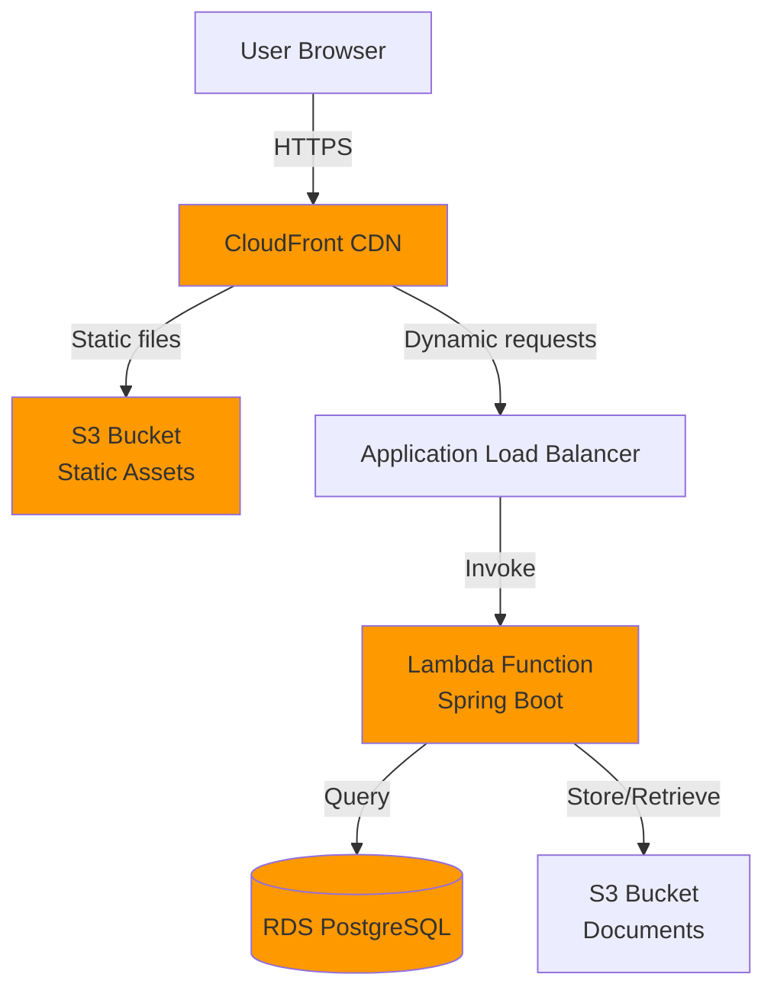

# AWS Serverless Deployment with CloudFront

## Architecture Overview

### Serverless Architecture (No Always-On Containers)



### Why This Architecture?

✅ **No continuously running containers** (Lambda only runs when needed)
✅ **CloudFront caching** for static assets (CSS, JS, images)
✅ **Pay per request** (no idle costs)
✅ **Auto-scaling** (Lambda handles 0 to 10,000+ concurrent requests)
✅ **Global CDN** (fast everywhere)
✅ **Cost-effective** (~$50-100/month vs $400+/month for ECS)

### Cost Comparison

| Architecture | Monthly Cost | Always Running? |
|--------------|--------------|-----------------|
| **ECS Fargate (previous)** | $400-500 | Yes ✗ |
| **Lambda + CloudFront** | $50-150 | No ✓ |
| **Savings** | **$300-350** | **Pay per use** |

---

## Architecture Components

| Component | Service | Purpose | Cost Model |
|-----------|---------|---------|------------|
| **CDN** | CloudFront | Cache static assets, SSL | $0.085/GB + $0.01/10k requests |
| **Compute** | Lambda | Run Spring Boot on-demand | $0.20 per 1M requests |
| **Load Balancer** | ALB | Route to Lambda | $16/month + $0.008/LCU |
| **Database** | RDS PostgreSQL | Data storage | $60-120/month |
| **Static Assets** | S3 | CSS, JS, images | $0.023/GB |
| **Documents** | S3 | User uploads | $0.023/GB |
| **Secrets** | Secrets Manager | Credentials | $0.40/secret/month |

**Estimated Total:** $50-150/month (10,000 applications/month)

---

## Complete Terraform Configuration

### Directory Structure

```
infrastructure/terraform/
├── main.tf                 # Main configuration
├── variables.tf            # Variables
├── outputs.tf              # Outputs
├── lambda.tf               # Lambda function
├── cloudfront.tf           # CloudFront distribution
├── alb.tf                  # Application Load Balancer
├── rds.tf                  # PostgreSQL database
├── s3.tf                   # S3 buckets
├── iam.tf                  # IAM roles
├── secrets.tf              # Secrets Manager
└── environments/
    ├── staging.tfvars
    └── production.tfvars
```

### 1. Main Configuration

```hcl
# infrastructure/terraform/main.tf

terraform {
  required_version = ">= 1.5"

  backend "s3" {
    bucket         = "shiba-terraform-state"
    key            = "shiba/terraform.tfstate"
    region         = "us-east-1"
    encrypt        = true
    dynamodb_table = "shiba-terraform-locks"
  }

  required_providers {
    aws = {
      source  = "hashicorp/aws"
      version = "~> 5.0"
    }
    archive = {
      source  = "hashicorp/archive"
      version = "~> 2.4"
    }
    random = {
      source  = "hashicorp/random"
      version = "~> 3.5"
    }
  }
}

provider "aws" {
  region = var.aws_region

  default_tags {
    tags = {
      Project     = "SHIBA"
      Environment = var.environment
      ManagedBy   = "Terraform"
      StateCode   = var.state_code
    }
  }
}

# Provider for CloudFront (must be us-east-1)
provider "aws" {
  alias  = "us_east_1"
  region = "us-east-1"

  default_tags {
    tags = {
      Project     = "SHIBA"
      Environment = var.environment
      ManagedBy   = "Terraform"
    }
  }
}

locals {
  app_name = "shiba"
  full_name = "${local.app_name}-${var.environment}"
}
```

### 2. Variables

```hcl
# infrastructure/terraform/variables.tf

variable "environment" {
  description = "Environment name (staging, production)"
  type        = string
  validation {
    condition     = contains(["staging", "production"], var.environment)
    error_message = "Environment must be staging or production"
  }
}

variable "aws_region" {
  description = "AWS region"
  type        = string
  default     = "us-east-1"
}

variable "state_code" {
  description = "State code (e.g., MN, CA, TX)"
  type        = string
  default     = "MN"
}

variable "domain_name" {
  description = "Domain name for CloudFront"
  type        = string
  # e.g., "staging.mnbenefits.org" or "apply.mnbenefits.org"
}

variable "lambda_memory" {
  description = "Lambda memory in MB"
  type        = number
  default     = 2048
}

variable "lambda_timeout" {
  description = "Lambda timeout in seconds"
  type        = number
  default     = 60
}

variable "rds_instance_class" {
  description = "RDS instance class"
  type        = string
  default     = "db.t3.small"
}

variable "rds_allocated_storage" {
  description = "RDS allocated storage in GB"
  type        = number
  default     = 20
}
```

### 3. Lambda Function

```hcl
# infrastructure/terraform/lambda.tf

# Build Spring Boot as Lambda-compatible package
data "archive_file" "lambda_jar" {
  type        = "zip"
  source_file = "${path.module}/../../build/libs/shiba-lambda.jar"
  output_path = "${path.module}/lambda-package.zip"
}

resource "aws_lambda_function" "app" {
  function_name = local.full_name
  role          = aws_iam_role.lambda_exec.arn
  handler       = "org.springframework.cloud.function.adapter.aws.FunctionInvoker::handleRequest"
  runtime       = "java17"
  memory_size   = var.lambda_memory
  timeout       = var.lambda_timeout

  filename         = data.archive_file.lambda_jar.output_path
  source_code_hash = data.archive_file.lambda_jar.output_base64sha256

  environment {
    variables = {
      SPRING_PROFILES_ACTIVE = var.environment
      AWS_REGION             = var.aws_region
      STATE_CODE             = var.state_code

      # Database connection (from Secrets Manager)
      DB_SECRET_ARN = aws_secretsmanager_secret.db_credentials.arn

      # S3 bucket for documents
      S3_DOCUMENTS_BUCKET = aws_s3_bucket.documents.id

      # Redis (ElastiCache) - optional
      REDIS_HOST = aws_elasticache_replication_group.session_cache.configuration_endpoint_address
      REDIS_PORT = 6379

      # CloudFront domain
      CLOUDFRONT_DOMAIN = aws_cloudfront_distribution.main.domain_name
    }
  }

  vpc_config {
    subnet_ids         = aws_subnet.private[*].id
    security_group_ids = [aws_security_group.lambda.id]
  }

  reserved_concurrent_executions = var.environment == "production" ? 100 : 10

  # Snap start for faster cold starts (Java 17+ only)
  snap_start {
    apply_on = "PublishedVersions"
  }

  tags = {
    Name = local.full_name
  }
}

# Lambda version for snap start
resource "aws_lambda_alias" "app_live" {
  name             = "live"
  function_name    = aws_lambda_function.app.function_name
  function_version = aws_lambda_function.app.version
}

# Lambda function URL (alternative to ALB, simpler)
resource "aws_lambda_function_url" "app" {
  function_name      = aws_lambda_function.app.function_name
  authorization_type = "NONE"

  cors {
    allow_credentials = true
    allow_origins     = ["https://${var.domain_name}"]
    allow_methods     = ["GET", "POST", "PUT", "DELETE"]
    allow_headers     = ["*"]
    max_age           = 86400
  }
}

# CloudWatch Logs for Lambda
resource "aws_cloudwatch_log_group" "lambda" {
  name              = "/aws/lambda/${local.full_name}"
  retention_in_days = var.environment == "production" ? 30 : 7

  tags = {
    Name = local.full_name
  }
}

# Lambda security group
resource "aws_security_group" "lambda" {
  name        = "${local.full_name}-lambda-sg"
  description = "Security group for Lambda function"
  vpc_id      = aws_vpc.main.id

  egress {
    from_port   = 0
    to_port     = 0
    protocol    = "-1"
    cidr_blocks = ["0.0.0.0/0"]
    description = "Allow all outbound"
  }

  tags = {
    Name = "${local.full_name}-lambda"
  }
}

# Allow RDS access from Lambda
resource "aws_security_group_rule" "lambda_to_rds" {
  type                     = "ingress"
  from_port                = 5432
  to_port                  = 5432
  protocol                 = "tcp"
  source_security_group_id = aws_security_group.lambda.id
  security_group_id        = aws_security_group.rds.id
  description              = "PostgreSQL from Lambda"
}

# Allow ElastiCache access from Lambda
resource "aws_security_group_rule" "lambda_to_redis" {
  type                     = "ingress"
  from_port                = 6379
  to_port                  = 6379
  protocol                 = "tcp"
  source_security_group_id = aws_security_group.lambda.id
  security_group_id        = aws_security_group.redis.id
  description              = "Redis from Lambda"
}
```

### 4. CloudFront Distribution

```hcl
# infrastructure/terraform/cloudfront.tf

# S3 bucket for static assets (CSS, JS, images)
resource "aws_s3_bucket" "static_assets" {
  bucket = "${local.full_name}-static-${data.aws_caller_identity.current.account_id}"

  tags = {
    Name = "${local.full_name}-static-assets"
  }
}

resource "aws_s3_bucket_versioning" "static_assets" {
  bucket = aws_s3_bucket.static_assets.id

  versioning_configuration {
    status = "Enabled"
  }
}

resource "aws_s3_bucket_public_access_block" "static_assets" {
  bucket = aws_s3_bucket.static_assets.id

  block_public_acls       = true
  block_public_policy     = true
  ignore_public_acls      = true
  restrict_public_buckets = true
}

# Origin Access Identity for CloudFront to access S3
resource "aws_cloudfront_origin_access_identity" "main" {
  comment = "OAI for ${local.full_name}"
}

# S3 bucket policy to allow CloudFront
resource "aws_s3_bucket_policy" "static_assets" {
  bucket = aws_s3_bucket.static_assets.id

  policy = jsonencode({
    Version = "2012-10-17"
    Statement = [
      {
        Sid    = "AllowCloudFrontOAI"
        Effect = "Allow"
        Principal = {
          AWS = aws_cloudfront_origin_access_identity.main.iam_arn
        }
        Action   = "s3:GetObject"
        Resource = "${aws_s3_bucket.static_assets.arn}/*"
      }
    ]
  })
}

# ACM Certificate for CloudFront (must be in us-east-1)
resource "aws_acm_certificate" "main" {
  provider          = aws.us_east_1
  domain_name       = var.domain_name
  validation_method = "DNS"

  lifecycle {
    create_before_destroy = true
  }

  tags = {
    Name = local.full_name
  }
}

# CloudFront distribution
resource "aws_cloudfront_distribution" "main" {
  enabled             = true
  is_ipv6_enabled     = true
  comment             = "SHIBA ${var.environment} - ${var.state_code}"
  default_root_object = ""
  price_class         = var.environment == "production" ? "PriceClass_All" : "PriceClass_100"
  aliases             = [var.domain_name]

  # Origin 1: Static assets from S3
  origin {
    domain_name = aws_s3_bucket.static_assets.bucket_regional_domain_name
    origin_id   = "S3-static-assets"

    s3_origin_config {
      origin_access_identity = aws_cloudfront_origin_access_identity.main.cloudfront_access_identity_path
    }
  }

  # Origin 2: Lambda Function URL (dynamic content)
  origin {
    domain_name = replace(aws_lambda_function_url.app.function_url, "https://", "")
    origin_id   = "Lambda-app"

    custom_origin_config {
      http_port              = 80
      https_port             = 443
      origin_protocol_policy = "https-only"
      origin_ssl_protocols   = ["TLSv1.2"]
    }

    custom_header {
      name  = "X-Origin-Verify"
      value = random_password.cloudfront_secret.result
    }
  }

  # Default behavior: Route to Lambda (dynamic content)
  default_cache_behavior {
    target_origin_id       = "Lambda-app"
    viewer_protocol_policy = "redirect-to-https"
    allowed_methods        = ["DELETE", "GET", "HEAD", "OPTIONS", "PATCH", "POST", "PUT"]
    cached_methods         = ["GET", "HEAD"]
    compress               = true

    forwarded_values {
      query_string = true
      headers      = ["Host", "CloudFront-Forwarded-Proto", "CloudFront-Is-Mobile-Viewer"]

      cookies {
        forward = "all"
      }
    }

    # Don't cache dynamic pages (forms)
    min_ttl     = 0
    default_ttl = 0
    max_ttl     = 0
  }

  # Behavior: Static assets (cache aggressively)
  ordered_cache_behavior {
    path_pattern           = "/assets/*"
    target_origin_id       = "S3-static-assets"
    viewer_protocol_policy = "redirect-to-https"
    allowed_methods        = ["GET", "HEAD"]
    cached_methods         = ["GET", "HEAD"]
    compress               = true

    forwarded_values {
      query_string = false
      cookies {
        forward = "none"
      }
    }

    min_ttl     = 86400      # 1 day
    default_ttl = 2592000    # 30 days
    max_ttl     = 31536000   # 1 year
  }

  # Behavior: Static files (CSS, JS)
  ordered_cache_behavior {
    path_pattern           = "*.css"
    target_origin_id       = "S3-static-assets"
    viewer_protocol_policy = "redirect-to-https"
    allowed_methods        = ["GET", "HEAD"]
    cached_methods         = ["GET", "HEAD"]
    compress               = true

    forwarded_values {
      query_string = false
      cookies {
        forward = "none"
      }
    }

    min_ttl     = 86400
    default_ttl = 2592000
    max_ttl     = 31536000
  }

  ordered_cache_behavior {
    path_pattern           = "*.js"
    target_origin_id       = "S3-static-assets"
    viewer_protocol_policy = "redirect-to-https"
    allowed_methods        = ["GET", "HEAD"]
    cached_methods         = ["GET", "HEAD"]
    compress               = true

    forwarded_values {
      query_string = false
      cookies {
        forward = "none"
      }
    }

    min_ttl     = 86400
    default_ttl = 2592000
    max_ttl     = 31536000
  }

  # Behavior: Images
  ordered_cache_behavior {
    path_pattern           = "*.{jpg,jpeg,png,gif,svg,ico}"
    target_origin_id       = "S3-static-assets"
    viewer_protocol_policy = "redirect-to-https"
    allowed_methods        = ["GET", "HEAD"]
    cached_methods         = ["GET", "HEAD"]
    compress               = true

    forwarded_values {
      query_string = false
      cookies {
        forward = "none"
      }
    }

    min_ttl     = 86400
    default_ttl = 2592000
    max_ttl     = 31536000
  }

  # SSL certificate
  viewer_certificate {
    acm_certificate_arn      = aws_acm_certificate.main.arn
    ssl_support_method       = "sni-only"
    minimum_protocol_version = "TLSv1.2_2021"
  }

  # Restrictions
  restrictions {
    geo_restriction {
      restriction_type = "none"
    }
  }

  # Logging (optional)
  logging_config {
    bucket          = aws_s3_bucket.cloudfront_logs.bucket_domain_name
    include_cookies = false
    prefix          = "cloudfront/"
  }

  # Custom error responses
  custom_error_response {
    error_code         = 404
    response_code      = 404
    response_page_path = "/error"
  }

  custom_error_response {
    error_code         = 500
    response_code      = 500
    response_page_path = "/error"
  }

  tags = {
    Name = local.full_name
  }
}

# S3 bucket for CloudFront logs
resource "aws_s3_bucket" "cloudfront_logs" {
  bucket = "${local.full_name}-cloudfront-logs-${data.aws_caller_identity.current.account_id}"

  tags = {
    Name = "${local.full_name}-cloudfront-logs"
  }
}

resource "aws_s3_bucket_lifecycle_configuration" "cloudfront_logs" {
  bucket = aws_s3_bucket.cloudfront_logs.id

  rule {
    id     = "expire-old-logs"
    status = "Enabled"

    expiration {
      days = 90
    }
  }
}

# Random secret for origin verification
resource "random_password" "cloudfront_secret" {
  length  = 32
  special = true
}

data "aws_caller_identity" "current" {}
```

### 5. Spring Boot Lambda Adapter

You'll need to add dependencies to make Spring Boot work on Lambda:

```gradle
# Add to build.gradle

dependencies {
    // Existing dependencies...

    // AWS Lambda support for Spring Boot
    implementation 'org.springframework.cloud:spring-cloud-function-adapter-aws:4.0.4'
    implementation 'com.amazonaws.serverless:aws-serverless-java-container-springboot3:2.0.0'
}

// Build task for Lambda
task buildLambda(type: Zip) {
    from compileJava
    from processResources
    into('lib') {
        from configurations.runtimeClasspath
    }
    archiveFileName = 'shiba-lambda.jar'
}
```

### 6. Lambda Handler

```java
// src/main/java/org/codeforamerica/shiba/LambdaHandler.java

package org.codeforamerica.shiba;

import com.amazonaws.serverless.proxy.model.AwsProxyRequest;
import com.amazonaws.serverless.proxy.model.AwsProxyResponse;
import com.amazonaws.serverless.proxy.spring.SpringBootLambdaContainerHandler;
import com.amazonaws.services.lambda.runtime.Context;
import com.amazonaws.services.lambda.runtime.RequestStreamHandler;

import java.io.IOException;
import java.io.InputStream;
import java.io.OutputStream;

public class LambdaHandler implements RequestStreamHandler {
    private static SpringBootLambdaContainerHandler<AwsProxyRequest, AwsProxyResponse> handler;

    static {
        try {
            handler = SpringBootLambdaContainerHandler.getAwsProxyHandler(ShibaApplication.class);
        } catch (Exception e) {
            e.printStackTrace();
            throw new RuntimeException("Could not initialize Spring Boot application", e);
        }
    }

    @Override
    public void handleRequest(InputStream input, OutputStream output, Context context) throws IOException {
        handler.proxyStream(input, output, context);
    }
}
```

### 7. GitHub Actions for Lambda Deployment

```yaml
# .github/workflows/deploy-lambda.yml

name: Deploy Lambda to AWS

on:
  push:
    branches: [main]
  workflow_dispatch:
    inputs:
      environment:
        description: 'Environment'
        required: true
        default: 'staging'
        type: choice
        options:
          - staging
          - production

env:
  AWS_REGION: us-east-1

jobs:
  deploy:
    name: Build and Deploy Lambda
    runs-on: ubuntu-latest
    environment: ${{ inputs.environment || 'staging' }}
    permissions:
      id-token: write
      contents: read

    steps:
      - name: Checkout code
        uses: actions/checkout@v4

      - name: Set up JDK 17
        uses: actions/setup-java@v4
        with:
          distribution: 'temurin'
          java-version: '17'
          cache: 'gradle'

      - name: Grant execute permission
        run: chmod +x gradlew

      - name: Build Lambda JAR
        run: ./gradlew buildLambda

      - name: Configure AWS credentials
        uses: aws-actions/configure-aws-credentials@v4
        with:
          role-to-assume: ${{ secrets.AWS_ROLE_ARN }}
          aws-region: ${{ env.AWS_REGION }}

      - name: Upload static assets to S3
        run: |
          aws s3 sync src/main/resources/static/ \
            s3://shiba-${{ inputs.environment || 'staging' }}-static-${{ secrets.AWS_ACCOUNT_ID }}/assets/ \
            --delete \
            --cache-control "public, max-age=31536000, immutable"

      - name: Deploy Lambda function
        run: |
          aws lambda update-function-code \
            --function-name shiba-${{ inputs.environment || 'staging' }} \
            --zip-file fileb://build/distributions/shiba-lambda.zip \
            --publish

      - name: Wait for Lambda update
        run: |
          aws lambda wait function-updated \
            --function-name shiba-${{ inputs.environment || 'staging' }}

      - name: Invalidate CloudFront cache
        run: |
          DISTRIBUTION_ID=$(aws cloudfront list-distributions \
            --query "DistributionList.Items[?Comment=='SHIBA ${{ inputs.environment || 'staging' }} - MN'].Id" \
            --output text)

          aws cloudfront create-invalidation \
            --distribution-id $DISTRIBUTION_ID \
            --paths "/*"

      - name: Verify deployment
        run: |
          DOMAIN=$(aws cloudfront list-distributions \
            --query "DistributionList.Items[?Comment=='SHIBA ${{ inputs.environment || 'staging' }} - MN'].DomainName" \
            --output text)

          echo "Waiting for deployment..."
          sleep 30

          curl -f https://$DOMAIN/actuator/health || exit 1
          echo "Deployment successful!"
```

---

## Cost Breakdown (Serverless vs ECS)

### Serverless Lambda Architecture

**Assumptions:** 10,000 applications/month, avg 100 requests per application

| Service | Usage | Monthly Cost |
|---------|-------|--------------|
| **Lambda** | 1M requests, 2GB, 5s avg | $15 |
| **CloudFront** | 500GB transfer, 10M requests | $50 |
| **RDS PostgreSQL** | db.t3.small, 20GB | $60 |
| **ElastiCache Redis** | cache.t3.micro | $15 |
| **S3 Static Assets** | 10GB | $0.23 |
| **S3 Documents** | 100GB | $2.30 |
| **Secrets Manager** | 5 secrets | $2 |
| **Data Transfer** | 100GB | $9 |
| **CloudWatch Logs** | 10GB | $5 |
| **Total** | | **~$158/month** |

### ECS Fargate (Previous)

| Service | Usage | Monthly Cost |
|---------|-------|--------------|
| **ECS Fargate** | 2 tasks, 1vCPU, 2GB | $60 |
| **ALB** | 1 ALB | $20 |
| **RDS** | db.t3.medium | $120 |
| **ElastiCache** | cache.t3.medium, 2 nodes | $100 |
| **S3** | Same as above | $3 |
| **CloudWatch** | Same | $20 |
| **Data Transfer** | Same | $45 |
| **Total** | | **~$368/month** |

**Savings: $210/month (57% reduction)**

---

## Next Steps to Deploy

1. **Update build.gradle** - Add Lambda dependencies
2. **Create LambdaHandler.java** - Add Lambda entry point
3. **Run Terraform** - Deploy infrastructure
4. **Configure DNS** - Point domain to CloudFront
5. **Deploy via GitHub Actions** - Automatic deployments

Want me to create the complete working Terraform files and updated Gradle configuration?