# SHIBA Architecture Diagrams (Mermaid)

## Current Architecture (Minnesota-Specific)

### High-Level System Architecture

```mermaid
graph TB
    User[👤 User - Minnesota Citizen]

    subgraph "Spring Boot Application"
        PC[PageController<br/>Thymeleaf Templates]
        SM[Session Manager<br/>JDBC Store]
        Event[ApplicationSubmittedEvent<br/>Async Processing]

        subgraph "Event Listeners"
            PDF[PDF Generator<br/>Apache PDFBox]
            Email[Email Service<br/>Mailgun Client]
            FileNet[MNIT FileNet Client<br/>SOAP]
            Analytics[Mixpanel Tracker]
        end

        PC --> SM
        PC --> Event
        Event --> PDF
        Event --> Email
        Event --> FileNet
        Event --> Analytics
    end

    subgraph "External Services"
        Mailgun[📧 Mailgun API<br/>mail.mnbenefits.mn.gov]
        MNIT[🏛️ MNIT FileNet<br/>SOAP Web Service]
        Mixpanel[📊 Mixpanel Analytics]
    end

    subgraph "Storage"
        Azure[☁️ Azure Blob Storage<br/>Uploaded Documents]
        DB[(🗄️ PostgreSQL<br/>applications<br/>application_status<br/>spring_session)]
    end

    User -->|HTTPS| PC
    Email --> Mailgun
    FileNet --> MNIT
    Analytics --> Mixpanel
    PDF --> Azure
    PC --> DB
    FileNet --> DB

    style User fill:#e1f5ff
    style PC fill:#fff3cd
    style Event fill:#f8d7da
    style DB fill:#d4edda
    style MNIT fill:#f8d7da
```



### Current Data Flow - Application Submission


### Hardcoded Dependencies


---

## Target Architecture (Multi-State)

### Multi-Tenant System Architecture

```mermaid
graph TB
    subgraph Users
        UserMN[👤 Minnesota User]
        UserCA[👤 California User]
        UserTX[👤 Texas User]
    end

    LB[⚖️ Load Balancer<br/>Tenant Detection]

    subgraph "Spring Boot Application - Multi-Tenant"
        TC[Tenant Context Service<br/>Load tenant config]
        PC[PageController<br/>Tenant-aware routing]
        Event[ApplicationSubmittedEvent]

        subgraph "Pluggable Services"
            DocService[Document Submission Service<br/>Adapter Selection]
            EmailService[Email Service<br/>Provider Factory]
            StorageService[Storage Service<br/>Provider Factory]
        end

        TC --> PC
        PC --> Event
        Event --> DocService
        Event --> EmailService
        Event --> StorageService
    end

    subgraph "Document Submission Adapters"
        MNIT[MNIT FileNet Adapter<br/>Minnesota SOAP]
        REST[REST API Adapter<br/>Generic States]
        SFTP[SFTP Adapter<br/>File-based States]
        EmailAdapter[Email Adapter<br/>Simple States]
    end

    subgraph "Database - Multi-Tenant"
        DB[(PostgreSQL)]

        subgraph "Config Tables"
            Tenants[tenants<br/>state_code, timezone, config]
            Regions[regions<br/>tenant_id, code, routing]
            Programs[programs<br/>tenant_id, code, name]
            Integrations[integrations<br/>tenant_id, provider, config]
        end

        subgraph "Data Tables"
            Apps[applications<br/>tenant_id, region_code, data]
            Status[application_status<br/>document_type, status]
        end
    end

    UserMN -->|mn.benefits.gov| LB
    UserCA -->|ca.benefits.gov| LB
    UserTX -->|tx.benefits.gov| LB

    LB -->|tenant=MN| TC
    LB -->|tenant=CA| TC
    LB -->|tenant=TX| TC

    DocService --> MNIT
    DocService --> REST
    DocService --> SFTP
    DocService --> EmailAdapter

    TC --> DB
    PC --> DB
    DocService --> DB

    style TC fill:#d4edda
    style DocService fill:#d1ecf1
    style EmailService fill:#d1ecf1
    style StorageService fill:#d1ecf1
    style DB fill:#d4edda
    style Tenants fill:#fff3cd
    style Integrations fill:#fff3cd
```



### Multi-Tenant Request Flow


### Document Submission Adapter Pattern


### Configuration Hierarchy


---

## Database Schema

### Current Schema (Minnesota)


### Target Multi-Tenant Schema


---

## Data Flow Diagrams

### Complete Application Flow (Multi-Tenant)


### Admin UI Workflow (Proposed)


---

## Integration Patterns

### Document Submission - SOAP (MNIT FileNet)


### Document Submission - REST API


### Document Submission - SFTP


### Email Provider Selection


---

## Deployment Architectures

### Option 1: Multi-Tenant SaaS


### Option 2: State-Isolated Deployments


---

## Security Architecture

### Authentication & Authorization Flow


### Data Security Layers


### Tenant Isolation Pattern

```mermaid
flowchart TD
    Request[Incoming Request]
    Request --> TenantFilter[Tenant Context Filter]

    TenantFilter --> Extract{Extract Tenant}
    Extract -->|Subdomain| FromDomain[mn.benefits.gov → MN]
    Extract -->|Session| FromSession[Session tenant_id]
    Extract -->|Admin| FromAuth[OAuth user → tenant]

    FromDomain --> Set[Set ThreadLocal Context]
    FromSession --> Set
    FromAuth --> Set

    Set --> Validate{Validate Tenant}
    Validate -->|Invalid| Error403[403 Forbidden]
    Validate -->|Valid| LoadConfig[Load Tenant Config]

    LoadConfig --> Controller[Controller Method]

    Controller --> Repository[Repository Query]
    Repository --> Interceptor[Query Interceptor]

    Interceptor --> AddFilter[Add WHERE tenant_id = ?]
    AddFilter --> Database[(Execute Query)]

    Database --> CheckRLS{Row Level Security}
    CheckRLS -->|Pass| ReturnData[Return Filtered Data]
    CheckRLS -->|Fail| Error403_2[403 Forbidden]

    ReturnData --> Response[HTTP Response]

    style TenantFilter fill:#fff3cd
    style Set fill:#d4edda
    style Interceptor fill:#d1ecf1
    style CheckRLS fill:#f8d7da
```



---

## Migration Strategy

### Phase-by-Phase Migration

```mermaid
gantt
    title Multi-State Transformation Timeline
    dateFormat YYYY-MM-DD
    section Phase 1
    Extract MN Logic          :p1, 2024-01-01, 6w
    Configuration Service     :p1a, 2024-01-01, 2w
    County to Region          :p1b, after p1a, 2w
    Tribal to Special Pops    :p1c, after p1b, 2w

    section Phase 2
    Integration Adapters      :p2, after p1, 8w
    Define Interfaces         :p2a, after p1, 1w
    MNIT Adapter Refactor     :p2b, after p2a, 2w
    REST/SFTP/Email Adapters  :p2c, after p2b, 5w

    section Phase 3
    Database Multi-Tenancy    :p3, after p1, 4w
    Add Tenant Tables         :p3a, after p1, 1w
    Migrate MN Data           :p3b, after p3a, 1w
    Update Repositories       :p3c, after p3b, 2w

    section Phase 4
    Pilot State               :p4, after p2, 8w
    Select State              :p4a, after p2, 1w
    Configure Pilot           :p4b, after p4a, 2w
    Deploy & Test             :p4c, after p4b, 3w
    Go Live                   :p4d, after p4c, 2w

    section Phase 5
    Business Rules            :p5, after p3, 6w
    Rules Engine Setup        :p5a, after p3, 2w
    Extract Eligibility       :p5b, after p5a, 4w

    section Phase 6
    Admin UI                  :p6, after p4, 12w
    API Design                :p6a, after p4, 2w
    Frontend Development      :p6b, after p6a, 8w
    Testing & Polish          :p6c, after p6b, 2w
```

### Data Migration Process

```mermaid
flowchart TD
    Start([Start Migration])

    Start --> Backup[Full Database Backup]
    Backup --> CreateTables[Create New Tables<br/>tenants, regions, programs]

    CreateTables --> InsertMN[Insert Minnesota Tenant<br/>INSERT INTO tenants]
    InsertMN --> ImportRegions[Import 87 Counties<br/>County enum → regions table]
    ImportRegions --> ImportPrograms[Import Programs<br/>SNAP, CCAP, etc.]

    ImportPrograms --> AlterApps[Alter applications table<br/>ADD COLUMN tenant_id]
    AlterApps --> UpdateApps[UPDATE applications<br/>SET tenant_id = 'minnesota']

    UpdateApps --> AddConstraints[Add Foreign Keys<br/>Add Indexes]
    AddConstraints --> UpdateCode[Deploy Code Changes<br/>Use tenant_id in queries]

    UpdateCode --> Validate{Validation Tests}
    Validate -->|Fail| Rollback[Rollback to Backup]
    Validate -->|Pass| Monitor[Monitor Production]

    Monitor --> Verify{All Working?}
    Verify -->|No| Investigate[Investigate Issues]
    Verify -->|Yes| Complete([Migration Complete])

    Investigate --> Fix[Fix Issues]
    Fix --> Verify

    Rollback --> Investigate2[Root Cause Analysis]
    Investigate2 --> FixMigration[Fix Migration Script]
    FixMigration --> Start

    style Backup fill:#fff3cd
    style Rollback fill:#f8d7da
    style Complete fill:#d4edda
```

This provides comprehensive visual documentation of the entire SHIBA architecture transformation using Mermaid diagrams!
