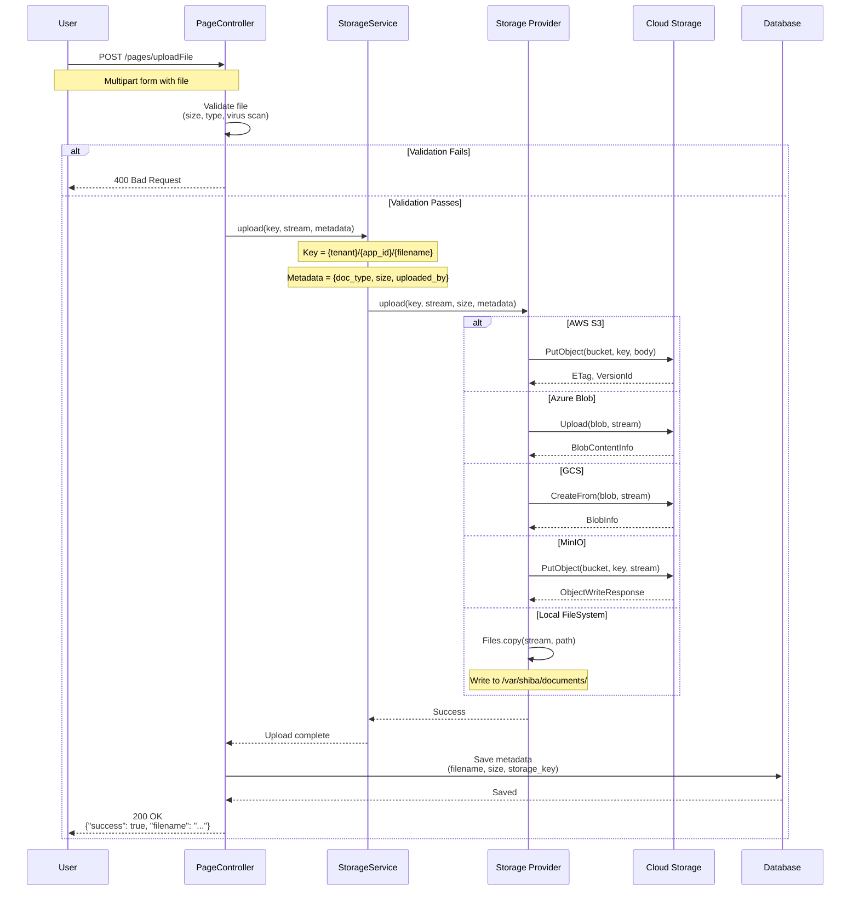
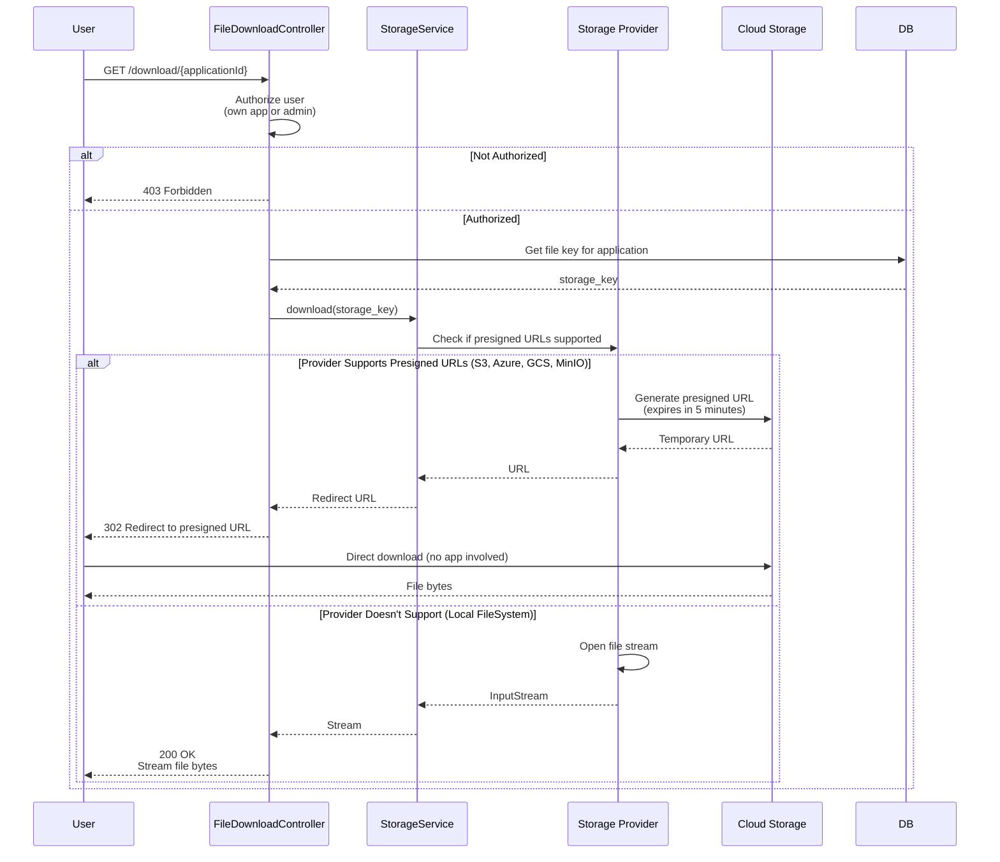
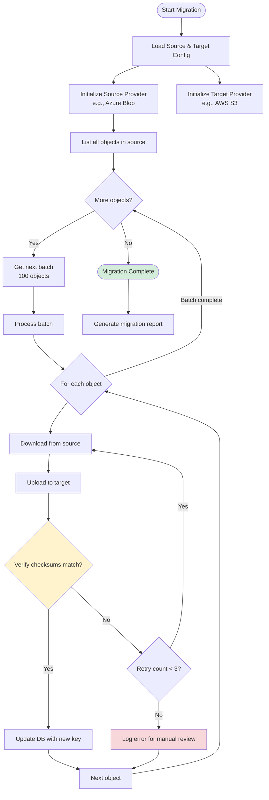
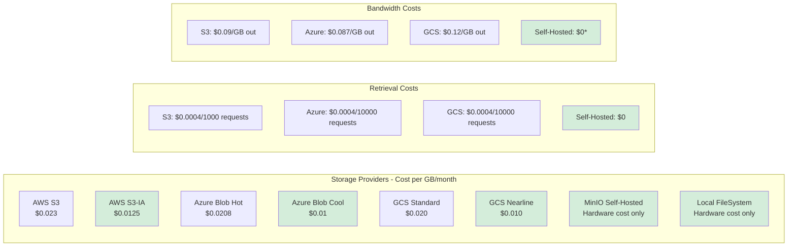
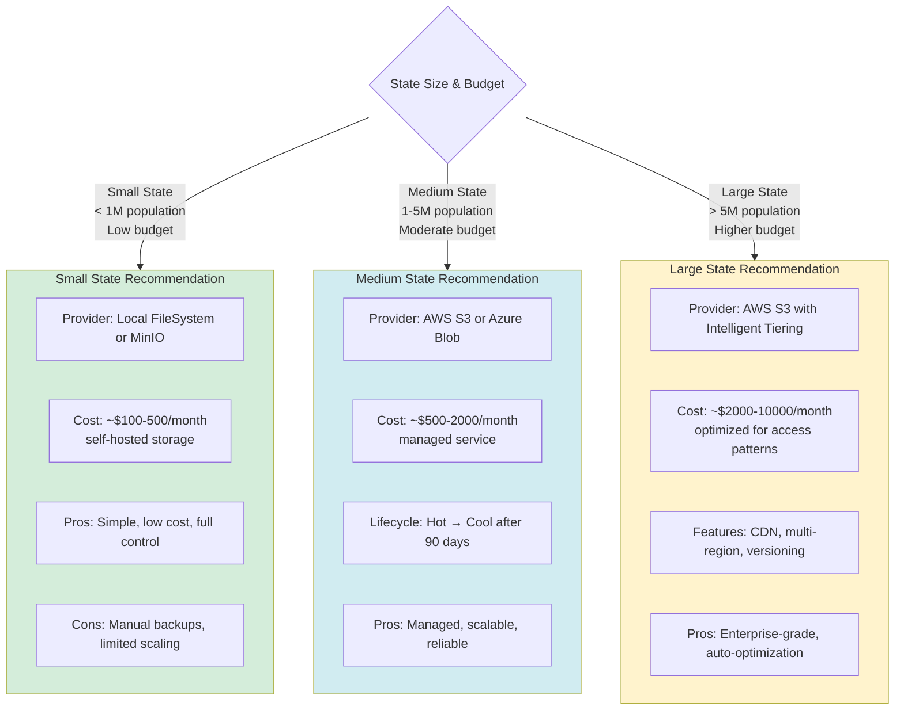
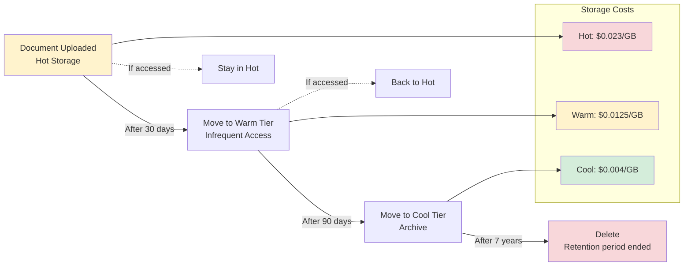
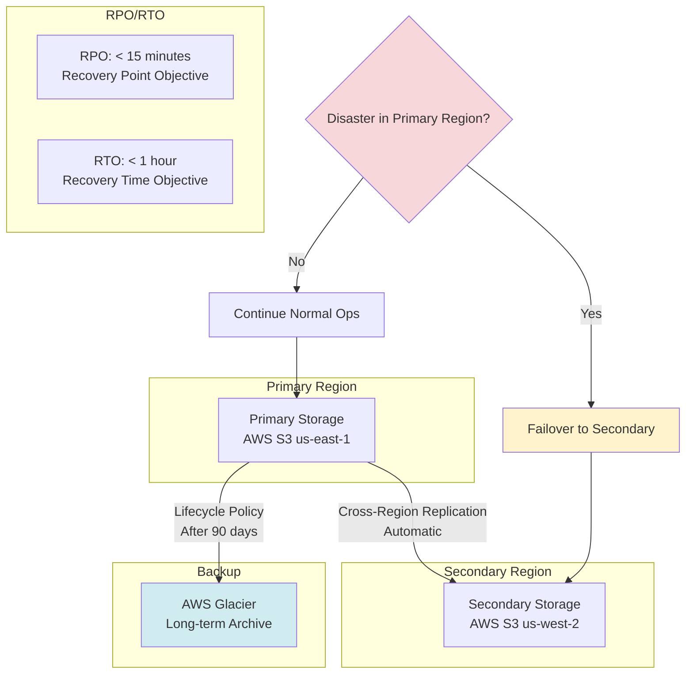
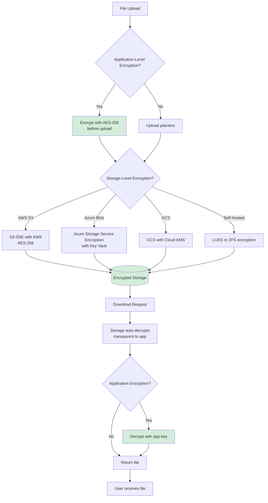

# Storage Service - Detailed Diagrams

## Storage Provider Selection Flow

```mermaid
flowchart TD
    Start[Application Startup]
    Start --> LoadConfig[Load Configuration]

    LoadConfig --> CheckProvider{Check STORAGE_PROVIDER}

    CheckProvider -->|aws_s3| CheckAWS{AWS Credentials?}
    CheckProvider -->|azure_blob| CheckAzure{Azure Connection String?}
    CheckProvider -->|gcs| CheckGCP{GCP Credentials?}
    CheckProvider -->|minio| CheckMinIO{MinIO Config?}
    CheckProvider -->|local_filesystem| CheckLocal{Base Path Exists?}
    CheckProvider -->|not set| DefaultProvider[Use Default for Cloud]

    CheckAWS -->|Yes| InitS3[Initialize S3StorageProvider]
    CheckAWS -->|No| ConfigError[Configuration Error]

    CheckAzure -->|Yes| InitAzure[Initialize AzureBlobStorageProvider]
    CheckAzure -->|No| ConfigError

    CheckGCP -->|Yes| InitGCP[Initialize GCSStorageProvider]
    CheckGCP -->|No| ConfigError

    CheckMinIO -->|Yes| InitMinIO[Initialize MinIOStorageProvider]
    CheckMinIO -->|No| ConfigError

    CheckLocal -->|Yes| InitLocal[Initialize LocalFileSystemProvider]
    CheckLocal -->|No| CreatePath{Create Path?}

    CreatePath -->|Success| InitLocal
    CreatePath -->|Fail| ConfigError

    DefaultProvider --> DetectCloud{Detect Cloud Environment}
    DetectCloud -->|AWS| InitS3
    DetectCloud -->|Azure| InitAzure
    DetectCloud -->|GCP| InitGCP
    DetectCloud -->|Unknown| InitLocal

    InitS3 --> HealthCheck[Health Check]
    InitAzure --> HealthCheck
    InitGCP --> HealthCheck
    InitMinIO --> HealthCheck
    InitLocal --> HealthCheck

    HealthCheck --> Test{Connection Test}
    Test -->|Pass| Ready[Storage Service Ready]
    Test -->|Fail| Startup Error[Startup Error]

    ConfigError --> Fail([Application Fails to Start])
    Startup Error --> Fail

    Ready --> RegisterBean[Register as Spring Bean]

    style CheckProvider fill:#fff3cd
    style DetectCloud fill:#d1ecf1
    style Ready fill:#d4edda
    style Fail fill:#f8d7da
```

## Document Upload Flow (Multi-Provider)



## Document Download Flow with Presigned URLs



## Storage Migration Tool



## Storage Cost Comparison



## Recommended Storage Strategy by State Size



## Storage Lifecycle Policy Example



## Disaster Recovery - Storage Replication



## Storage Security - Encryption at Rest



This provides comprehensive visual documentation for the storage abstraction layer!
