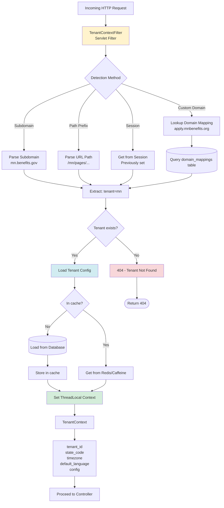
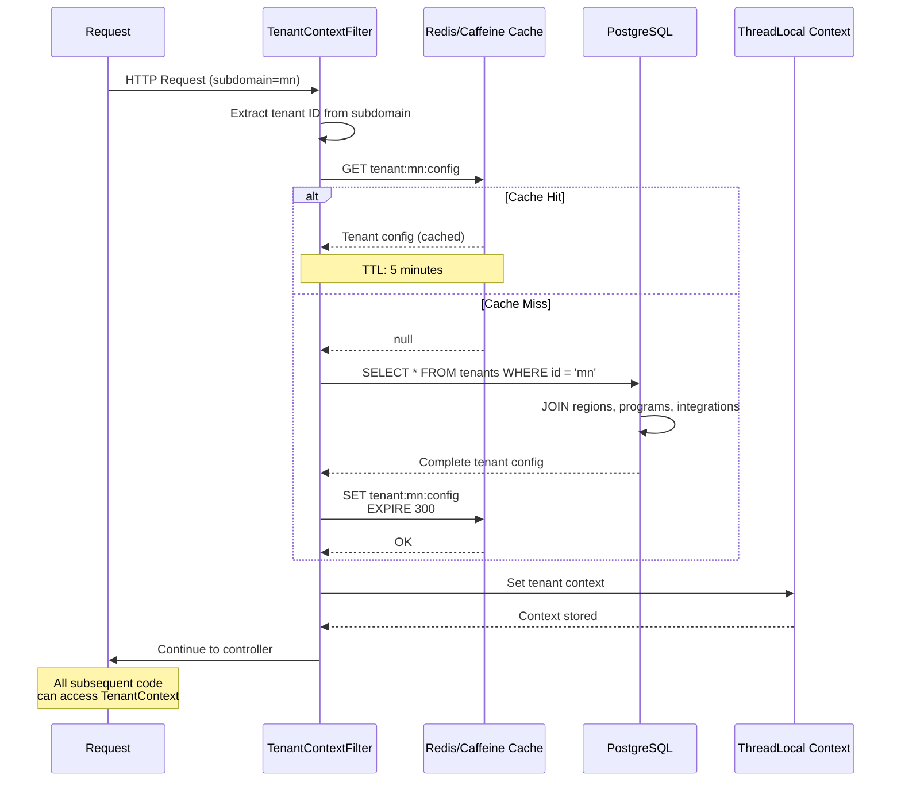
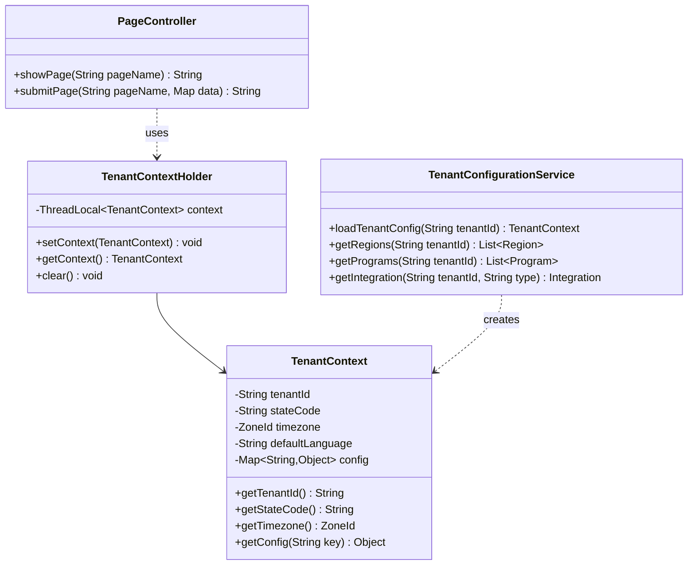
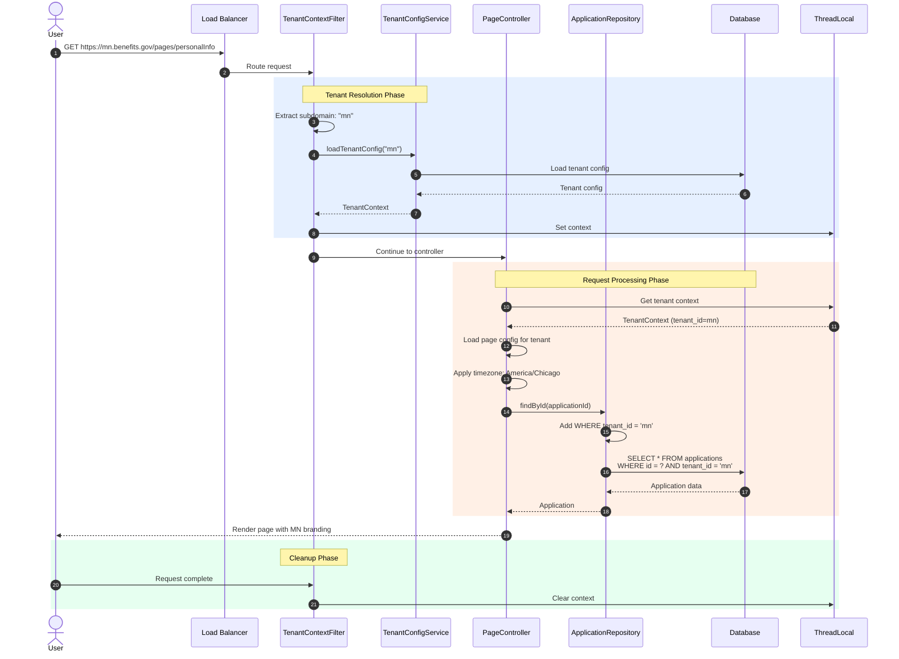
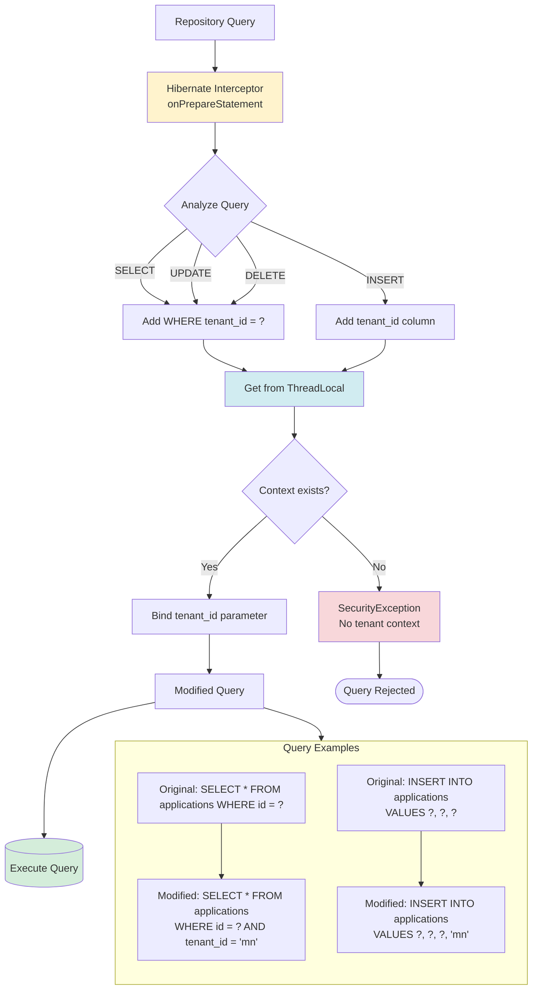
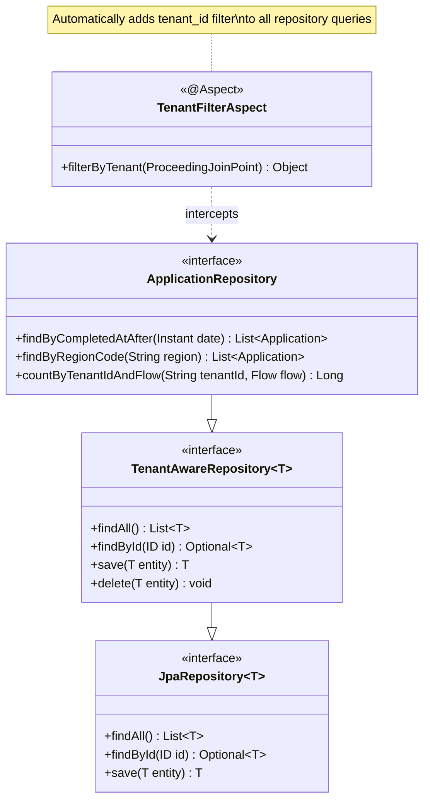
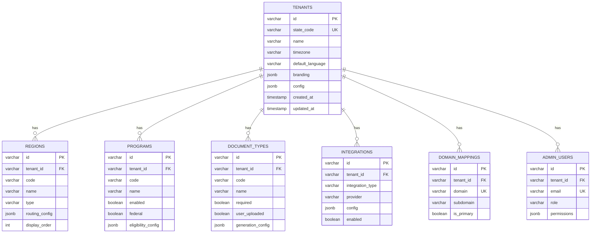
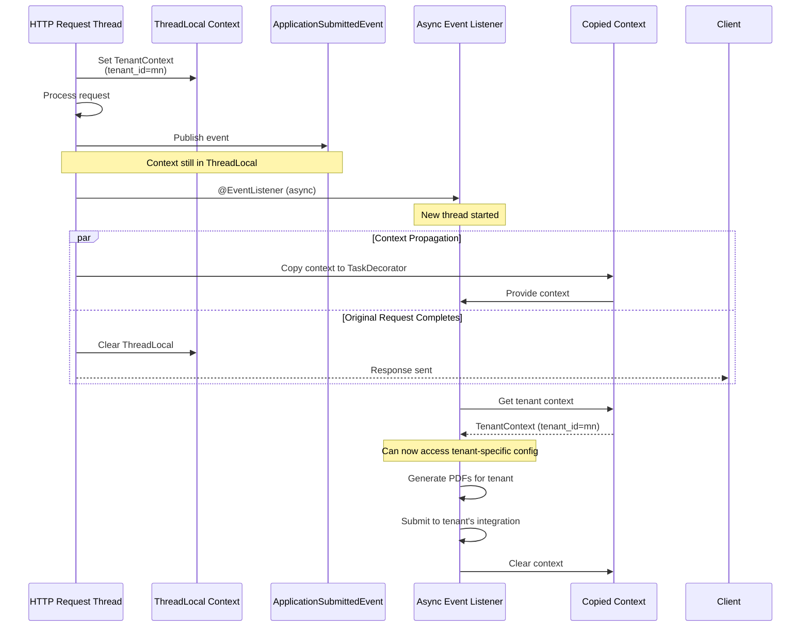
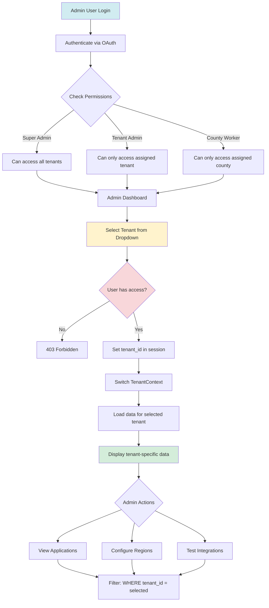
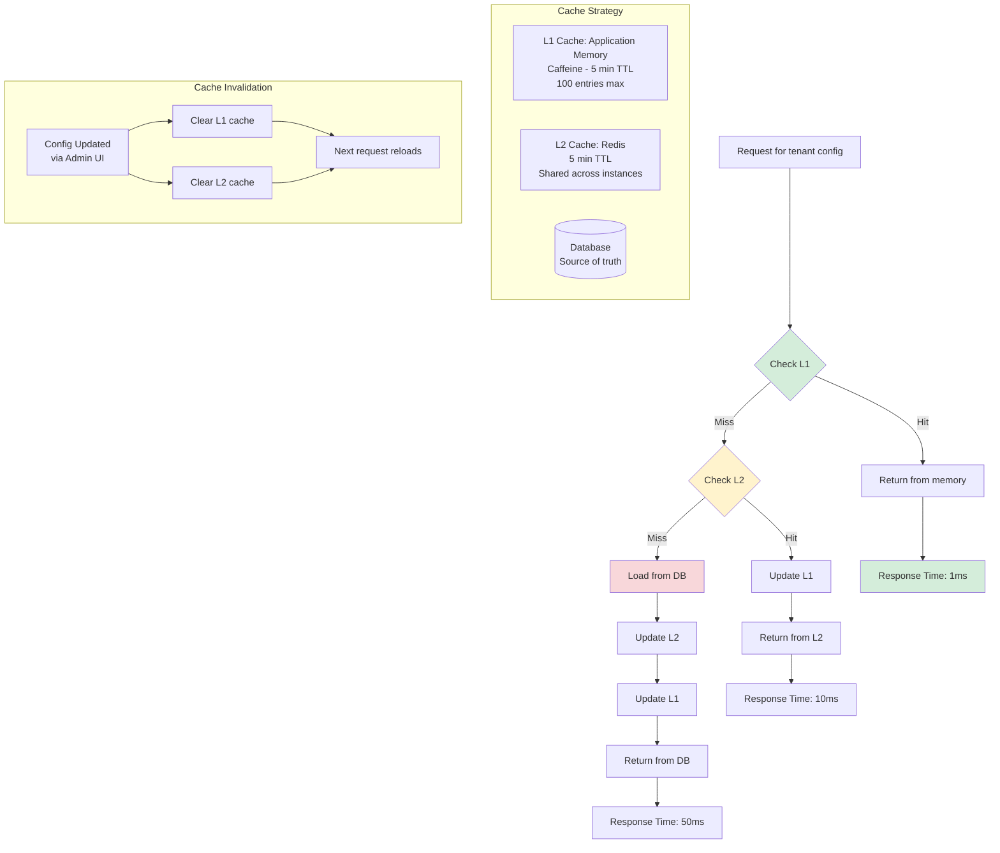

# Tenant Context - Detailed Diagrams

## Tenant Detection and Resolution



## Tenant Configuration Caching Strategy



## Tenant Context Access Patterns



## Multi-Tenant Request Lifecycle



## Tenant Isolation - Database Query Interceptor



## Tenant-Aware Repository Pattern



## Tenant Configuration Schema



## Tenant Context Propagation (Async Tasks)



## Tenant Context Configuration

```java
@Configuration
public class TenantContextConfiguration {

    @Bean
    public FilterRegistrationBean<TenantContextFilter> tenantContextFilter() {
        FilterRegistrationBean<TenantContextFilter> registration = new FilterRegistrationBean<>();
        registration.setFilter(new TenantContextFilter(tenantConfigurationService()));
        registration.addUrlPatterns("/*");
        registration.setOrder(1); // Run first
        return registration;
    }

    @Bean
    public TaskDecorator tenantContextTaskDecorator() {
        return runnable -> {
            // Capture context from current thread
            TenantContext context = TenantContextHolder.getContext();

            // Return decorated runnable that sets context in new thread
            return () -> {
                try {
                    TenantContextHolder.setContext(context);
                    runnable.run();
                } finally {
                    TenantContextHolder.clear();
                }
            };
        };
    }

    @Bean
    public Executor asyncExecutor() {
        ThreadPoolTaskExecutor executor = new ThreadPoolTaskExecutor();
        executor.setCorePoolSize(10);
        executor.setMaxPoolSize(20);
        executor.setQueueCapacity(500);
        executor.setThreadNamePrefix("tenant-async-");
        executor.setTaskDecorator(tenantContextTaskDecorator());
        executor.initialize();
        return executor;
    }
}
```

## Tenant Switching (Admin Use Case)



## Performance: Tenant Config Caching



This provides comprehensive visual documentation for the tenant context and multi-tenancy architecture!
